# AI相册APP 产品需求文档

## 1. Product Overview
AI相册APP是一款自托管的智能照片与视频管理平台，参考immich的设计理念，融合自动备份、AI增强搜索、人脸识别、智能分类与时间轨迹功能。
- 核心问题：照片分散存储、查找困难、缺乏智能管理手段、隐私安全担忧
- 差异化价值：本地化部署保障隐私，OCR+CLIP+人脸识别实现多维智能搜索，提供类immich体验的同时强化中文场景AI能力，智能相册自动分类+年度回顾增强用户情感连接
- 目标用户：注重隐私的个人用户、家庭用户、小型团队
- 部署平台：Ubuntu 22.04 ARM64 (首选)，兼容x86_64
- 客户端：Web端 + 移动端APP（Android/iOS），移动端采用Flutter开发，参考immich移动端架构
- 产品形态：服务端自托管 + 原生移动客户端，用户通过移动端APP实现照片自动备份和浏览，通过Web端进行高级管理和AI搜索

### 1.1 Competitive Feature Matrix (竞品功能对比)

> 对比主流照片管理产品的功能覆盖度，明确AI Album的差异化优势和功能缺口。

| 功能类别 | 功能项 | AI Album | immich | Google Photos | Apple Photos | Lychee | PhotoPrism |
|----------|--------|----------|--------|---------------|--------------|--------|------------|
| **基础管理** | 照片上传 | ✅ | ✅ | ✅ | ✅ | ✅ | ✅ |
| | 视频上传 | ✅ | ✅ | ✅ | ✅ | ✅ | ✅ |
| | 时间线浏览 | ✅ | ✅ | ✅ | ✅ | ✅ | ✅ |
| | 相册管理 | ✅ | ✅ | ✅ | ✅ | ✅ | ✅ |
| | 收藏/归档 | ✅ | ✅ | ✅ | ✅ | ❌ | ✅ |
| | 回收站 | ✅ 30天 | ✅ 30天 | ✅ 60天 | ✅ 30天 | ❌ | ✅ |
| | 批量操作 | ✅ | ✅ | ✅ | ✅ | ⚠️ 有限 | ✅ |
| | 照片编辑 | ✅ 基础 | ⚠️ 有限 | ✅ 强大 | ✅ 强大 | ❌ | ⚠️ 有限 |
| | LivePhoto | ✅ | ✅ | ❌ | ✅ 原生 | ❌ | ❌ |
| | 批量下载ZIP | ✅ | ✅ | ⚠️ Takeout | ❌ | ✅ | ✅ |
| **AI搜索** | 文本搜索 | ✅ | ✅ | ✅ | ✅ | ✅ | ✅ |
| | OCR文字搜索 | ✅ PaddleOCR | ✅ Tesseract | ✅ | ❌ | ❌ | ✅ Tesseract |
| | 中文OCR | ✅ 原生支持 | ⚠️ 需配置 | ✅ | ❌ | ❌ | ⚠️ 需配置 |
| | 语义搜索 | ✅ CLIP多语言 | ❌ | ✅ | ✅ | ❌ | ✅ CLIP英文 |
| | 中文语义搜索 | ✅ XLM-Roberta | ❌ | ✅ | ❌ | ❌ | ❌ |
| | 人脸识别 | ✅ InsightFace | ✅ | ✅ | ✅ | ❌ | ✅ |
| | 人脸聚类 | ✅ | ✅ | ✅ | ✅ | ❌ | ✅ |
| | 智能分类 | ✅ CLIP自动 | ❌ | ✅ | ✅ | ❌ | ✅ |
| | 混合搜索 | ✅ 4模式加权 | ❌ | ✅ | ❌ | ❌ | ❌ |
| | 搜索建议 | ✅ | ❌ | ✅ | ❌ | ❌ | ❌ |
| **地图与位置** | 地图浏览 | ✅ Leaflet | ✅ Mapbox | ✅ | ✅ | ❌ | ✅ |
| | 反向地理编码 | ✅ Nominatim | ✅ | ✅ | ✅ | ❌ | ✅ |
| | 旅行轨迹 | ❌ | ❌ | ✅ | ✅ | ❌ | ❌ |
| **分享与协作** | 公开分享链接 | ✅ | ✅ | ✅ | ✅ 共享相册 | ✅ | ✅ |
| | 分享密码保护 | ✅ | ❌ | ❌ | ❌ | ❌ | ❌ |
| | 分享过期时间 | ✅ | ❌ | ❌ | ❌ | ❌ | ❌ |
| | 伙伴共享 | ✅ | ✅ | ✅ | ❌ | ❌ | ❌ |
| | 共享图库 | ✅ | ❌ | ✅ | ✅ | ❌ | ❌ |
| | 相册评论/点赞 | ✅ | ✅ | ❌ | ❌ | ❌ | ❌ |
| **移动端** | 自动备份 | ✅ Flutter | ✅ Flutter | ✅ 原生 | ✅ 原生 | ❌ | ❌ |
| | 后台备份 | ✅ | ✅ | ✅ | ✅ | ❌ | ❌ |
| | 释放空间 | ✅ | ✅ | ✅ | ✅ | ❌ | ❌ |
| | 离线浏览 | ✅ | ⚠️ 有限 | ✅ | ✅ | ❌ | ❌ |
| | 只读/儿童模式 | ✅ | ❌ | ❌ | ❌ | ❌ | ❌ |
| **管理与运维** | 多用户 | ✅ | ✅ | ✅ | ❌ | ❌ | ✅ |
| | 存储配额 | ✅ | ✅ | ✅ 付费 | ✅ iCloud | ❌ | ❌ |
| | 外部库挂载 | ✅ | ✅ | ❌ | ❌ | ✅ | ✅ |
| | 任务队列管理 | ✅ | ✅ | ❌ | ❌ | ❌ | ⚠️ 有限 |
| | 系统动态配置 | ✅ | ✅ | ❌ | ❌ | ❌ | ⚠️ 有限 |
| | 2FA两步验证 | ✅ | ✅ | ✅ | ✅ | ❌ | ❌ |
| | 会话管理 | ✅ | ✅ | ✅ | ✅ | ❌ | ❌ |
| | API Key | ✅ | ✅ | ✅ | ❌ | ❌ | ✅ |
| | Prometheus监控 | ✅ | ❌ | ❌ | ❌ | ❌ | ❌ |
| **特色功能** | 年度回顾 | ✅ | ❌ | ✅ | ✅ | ❌ | ❌ |
| | Memories回忆集 | ✅ | ❌ | ✅ | ✅ | ❌ | ❌ |
| | 重复检测 | ✅ | ✅ | ❌ | ❌ | ❌ | ✅ |
| | 精选照片 | ✅ | ❌ | ✅ | ✅ | ❌ | ❌ |
| | 数据导入(immich) | ✅ | N/A | Takeout | ❌ | ❌ | ❌ |
| | 数据导入(Google) | ✅ | ❌ | N/A | ❌ | ❌ | ❌ |
| | XMP Sidecar | ✅ | ✅ | ❌ | ❌ | ❌ | ✅ |
| | 虚拟滚动Scrubber | ✅ | ✅ | ❌ | ❌ | ❌ | ❌ |
| | 通知中心 | ✅ | ✅ | ✅ | ✅ | ❌ | ❌ |
| | PWA支持 | ✅ | ❌ | ✅ | ❌ | ❌ | ❌ |
| **商业化** | 订阅计费 | ✅ Phase 5 | ❌ | ✅ | ✅ | ❌ | ❌ |
| | 多租户 | ✅ Phase 5 | ❌ | ✅ | ❌ | ❌ | ❌ |
| | 白标定制 | ✅ Phase 5 | ❌ | ❌ | ❌ | ❌ | ❌ |
| | GDPR/PIPL合规 | ✅ | ⚠️ 部分 | ✅ | ✅ | ❌ | ⚠️ 部分 |
| **部署** | 自托管 | ✅ Docker | ✅ Docker | ❌ 云端 | ❌ 云端 | ✅ Docker | ✅ Docker |
| | ARM64支持 | ✅ | ✅ | ❌ | ❌ | ✅ | ✅ |
| | 一键安装 | ✅ | ✅ | ❌ | ❌ | ✅ | ✅ |

**AI Album核心差异化优势:**
1. **中文AI能力最强**: 唯一支持中文语义搜索(XLM-Roberta CLIP) + 中文OCR(PaddleOCR)的自托管相册
2. **混合搜索**: 4种搜索模式(文本/OCR/语义/人脸)加权合并，其他产品仅支持单一模式
3. **年度回顾+Memories**: immich/PhotoPrism不具备的情感连接功能
4. **分享安全**: 唯一支持密码保护+过期时间的自托管相册
5. **商业化就绪**: 唯一内置订阅计费+多租户+白标定制的自托管方案

**AI Album功能缺口(相比竞品):**
1. ❌ 旅行轨迹(地图上连线) — Google/Apple Photos支持
2. ❌ AI照片增强(去模糊/超分辨率) — Google Photos支持
3. ❌ 物体识别/Visual Look Up — Google/Apple Photos支持
4. ⚠️ 照片编辑能力较弱 — Google/Apple Photos远超
5. ⚠️ 无原生地图SDK(使用Leaflet) — immich使用Mapbox体验更好

## 2. Core Features

### 2.1 User Roles
| Role | Registration Method | Core Permissions |
|------|---------------------|------------------|
| Normal User | 邮箱密码注册 | 上传、浏览、AI搜索、分类管理、分享、相册管理 |
| Admin | 首个注册用户自动成为Admin | 用户管理、角色分配、系统配置、存储监控、任务队列管理 |

**角色规则：**
- 首个注册用户自动成为Admin
- Admin可在管理页将其他用户提升为Admin或降级为普通用户
- 至少保留一个Admin账户，不允许删除最后一个Admin
- Admin拥有普通用户所有权限

### 2.2 Feature Module
1. **登录/注册页**: 邮箱密码认证、密码重置
2. **Onboarding页**: 新用户3步引导（欢迎→上传→AI功能介绍）
3. **首页**: 照片时间线、智能搜索栏、统计概览、回忆（X年前的今天）
4. **探索页**: 人物浏览、地点浏览、标签浏览
5. **相册页**: 个人相册、共享相册
6. **地图页**: 全球地图、地点聚类、照片列表
7. **照片详情页**: 大图预览、EXIF信息、OCR文本、人脸标注、操作面板
8. **上传页**: 批量上传、AI处理实时进度追踪
9. **搜索页**: 智能搜索（默认）、高级搜索模式、搜索历史、搜索建议
10. **收藏与归档**: 收藏夹、归档管理、回收站
11. **分享页**: 公开分享、伙伴共享
12. **管理页**: 用户管理、任务队列、系统配置（仅Admin）
13. **设置页**: 账户管理、存储用量、AI功能配置、语言设置
14. **外部库**: 挂载外部目录作为照片源，支持AINAS等NAS产品集成
15. **移动端APP**: 自动备份、前台/后台备份、选择性相册备份、释放空间、相册同步、离线浏览、只读模式
16. **智能相册**: 基于CLIP向量自动分类（宠物/食物/建筑/自然/车辆/人物等），自动更新，参考Google Photos智能分类
17. **年度回顾**: 年度照片报告，高光时刻汇总，可分享卡片，参考Google Photos Recap和Spotify Wrapped
18. **重复检测**: 专门的重复/相似照片管理页面，支持批量合并/删除，参考immich重复检测工具
19. **共享图库**: 家庭成员共享照片空间，自动共享指定人物/时间范围的照片，参考Google Photos/Apple Photos共享图库
20. **虚拟滚动Scrubber**: 时间线右侧快速导航拖拽条，按月/年跳转，参考immich Scrubber
21. **通知中心**: 全局通知铃铛、通知列表、已读/未读管理、通知设置(邮件/应用内)，参考immich Notifications
22. **会话管理**: 查看所有登录设备、撤销指定会话、撤销所有其他会话，参考immich Sessions
23. **相册活动**: 共享相册内评论和点赞、活动统计，参考immich Activities
24. **系统配置管理**: Admin动态配置(无需重启)、配置项分组管理，参考immich System Config
25. **服务器信息**: 版本/存储/数据库/Redis/ML服务状态、健康检查，参考immich Server Info

### 2.3 Supported File Formats

#### 图片格式
| 格式 | 扩展名 | MIME Type | 说明 |
|------|--------|-----------|------|
| JPEG | .jpg, .jpeg | image/jpeg | 主流照片格式 |
| PNG | .png | image/png | 无损格式 |
| WebP | .webp | image/webp | 现代压缩格式 |
| HEIC/HEIF | .heic, .heif | image/heic, image/heif | Apple格式 |
| TIFF | .tiff, .tif | image/tiff | 专业格式 |
| GIF | .gif | image/gif | 动图格式 |
| BMP | .bmp | image/bmp | 位图格式 |
| RAW | .cr2, .nef, .arw, .dng | image/x-* | 相机原始格式(仅提取缩略图) |

#### 视频格式
| 格式 | 扩展名 | MIME Type | 说明 |
|------|--------|-----------|------|
| MP4 | .mp4 | video/mp4 | 主流视频格式 |
| QuickTime | .mov | video/quicktime | Apple视频格式 |
| WebM | .webm | video/webm | Web视频格式 |
| AVI | .avi | video/x-msvideo | 传统视频格式 |

#### LivePhoto/MotionPhoto
| 格式 | 来源 | 说明 |
|------|------|------|
| Apple LivePhoto | iOS相机 | JPEG+MOV配对，通过Apple的contentIdentifier关联 |
| Samsung MotionPhoto | Samsung相机 | HEVC+JPEG封装在单个文件中 |
| Google MotionPhoto | Pixel相机 | MV+JPEG封装在单个文件中 |

**LivePhoto处理规则：**
- 上传时检测LivePhoto配对（通过Apple contentIdentifier EXIF字段匹配JPEG和MOV）
- Samsung/Google MotionPhoto从单文件中拆分出静态图和视频
- 浏览时显示静态图，长按/点击播放动态效果
- LivePhoto在时间线中显示特殊标识（动态图标）

**文件限制：**
- 单文件最大：200MB
- 单次上传最多：50个文件
- 不支持的格式：上传时提示"不支持的文件格式"并列出支持格式

### 2.4 Storage Quota

| 配置项 | 默认值 | 说明 |
|--------|--------|------|
| 新用户默认配额 | 10GB | Admin可在管理页修改 |
| 配额为null | 无限制 | 不设上限 |
| 配额使用率 > 80% | 黄色警告 | 设置页和首页统计显示 |
| 配额使用率 > 95% | 红色警告 + 禁止上传 | Toast提示"存储空间不足" |
| Admin配额 | 无限制 | 默认不限制 |

### 2.5 User Stories

> 格式: As a [角色], I want [功能], so that [价值/目的]
> 验收标准: Given [前置条件] When [操作] Then [预期结果]

#### 2.5.1 认证与账户管理

| ID | User Story | 验收标准 |
|----|-----------|----------|
| US-AUTH-001 | As a 新用户, I want 通过邮箱密码注册账户, so that 我可以拥有独立的照片管理空间 | Given 邮箱未注册 When 提交有效邮箱+密码(≥8位) Then 创建账户并跳转Onboarding |
| US-AUTH-002 | As a 已注册用户, I want 通过邮箱密码登录, so that 我可以访问我的照片库 | Given 账户存在且密码正确 When 提交登录表单 Then 跳转首页并建立会话 |
| US-AUTH-003 | As a 忘记密码的用户, I want 通过邮箱重置密码, so that 我可以重新获得账户访问权 | Given 邮箱已注册 When 点击忘记密码→输入邮箱 Then 发送重置邮件(1小时有效)，不提示邮箱是否存在 |
| US-AUTH-004 | As a 多设备用户, I want 查看和管理所有登录会话, so that 我可以确保账户安全 | Given 已登录 When 访问设置→会话管理 Then 显示所有活跃会话(设备/IP/时间)，可撤销指定会话 |
| US-AUTH-005 | As a 安全敏感用户, I want 启用两步验证(2FA), so that 我的账户不会被未授权访问 | Given 已登录 When 设置页启用2FA Then 显示TOTP二维码+10个恢复码，下次登录需验证码 |
| US-AUTH-006 | As a 管理员, I want 管理用户账户和角色, so that 我可以控制系统的访问权限 | Given 当前用户为Admin When 管理页操作用户 Then 可创建/禁用/删除用户、修改角色和配额，不能删除最后一个Admin |
| US-AUTH-007 | As a 用户, I want 删除我的账户, so that 我可以完全清除我的个人数据 | Given 已登录 When 设置页删除账户→输入密码确认 Then 删除所有数据(照片/相册/标签/人脸数据)，7天内不可恢复 |

#### 2.5.2 照片上传与管理

| ID | User Story | 验收标准 |
|----|-----------|----------|
| US-PHOTO-001 | As a 用户, I want 批量上传照片和视频, so that 我可以将本地媒体集中管理 | Given 存储配额充足 When 拖拽或选择文件(≤50个，单文件≤200MB) Then 上传并显示进度，完成后进入AI处理流水线 |
| US-PHOTO-002 | As a 用户, I want 在时间线上按拍摄时间浏览照片, so that 我可以按时间回忆和查找照片 | Given 有已上传照片 When 访问首页 Then 瀑布流展示照片，按taken_at倒序，虚拟滚动无限加载 |
| US-PHOTO-003 | As a 用户, I want 批量选择照片进行操作, so that 我可以高效管理大量照片 | Given 时间线有照片 When 长按或点击多选按钮 Then 进入多选模式，底部显示操作栏(收藏/归档/删除/加入相册) |
| US-PHOTO-004 | As a 用户, I want 收藏和归档照片, so that 我可以快速找到重要照片并整理时间线 | Given 浏览照片 When 点击收藏/归档按钮 Then 收藏即时反映在收藏页，归档照片从时间线隐藏但仍可搜索 |
| US-PHOTO-005 | As a 用户, I want 删除照片后能恢复, so that 我不会因误操作丢失珍贵照片 | Given 照片存在 When 删除照片 Then 移入回收站(30天自动清除)，回收站内可恢复或永久删除 |
| US-PHOTO-006 | As a 用户, I want 查看照片的详细信息, so that 我可以了解拍摄参数和AI分析结果 | Given 照片存在 When 点击照片进入详情页 Then 显示大图+EXIF+OCR文本+人脸标注+智能分类+位置地图 |
| US-PHOTO-007 | As a 用户, I want 编辑照片(裁剪/旋转/滤镜), so that 我可以改善照片效果而不丢失原图 | Given 照片存在 When 详情页点击编辑 Then 编辑后保存为新版本，原图保留可恢复 |
| US-PHOTO-008 | As a 用户, I want 上传LivePhoto/MotionPhoto, so that 我可以保留动态回忆 | Given 上传Apple LivePhoto(JPEG+MOV)或Samsung MotionPhoto When 系统检测到配对/封装 Then 自动关联，浏览时长按播放动态效果 |
| US-PHOTO-009 | As a 用户, I want 通过Scrubber快速导航到特定时间, so that 我可以在大量照片中快速定位 | Given 时间线有照片 When 拖拽右侧Scrubber条 Then 显示月份/年份标签，松手跳转到对应位置 |

#### 2.5.3 AI智能功能

| ID | User Story | 验收标准 |
|----|-----------|----------|
| US-AI-001 | As a 用户, I want 用自然语言搜索照片, so that 我不需要记住文件名或手动分类就能找到照片 | Given 照片已完成CLIP处理 When 输入"海边的日落" Then 返回语义匹配的照片，按相关性排序 |
| US-AI-002 | As a 用户, I want 搜索照片中的文字, so that 我可以找到包含特定文字内容的照片(如文档、路牌、菜单) | Given 照片已完成OCR处理 When 搜索关键词 Then 返回OCR文本匹配的照片，高亮匹配文字 |
| US-AI-003 | As a 用户, I want 自动识别和归类照片中的人物, so that 我可以按人物浏览所有照片 | Given 照片已完成人脸处理 When 访问探索页→人物 Then 显示人脸聚类网格，可命名/合并/隐藏人物 |
| US-AI-004 | As a 用户, I want 照片自动分类到智能相册, so that 我不需要手动整理就能按类别浏览 | Given 照片已完成CLIP处理 When 访问探索页→智能分类 Then 显示自动分类(宠物/食物/自然等)，新照片自动归入 |
| US-AI-005 | As a 用户, I want 查看AI处理进度, so that 我知道何时可以使用AI搜索功能 | Given 照片正在处理 When 查看上传页或照片详情 Then 显示各阶段进度(缩略图→OCR→CLIP→人脸)，失败可重试 |
| US-AI-006 | As a 用户, I want 查看"X年前的今天"回忆, so that 我可以重温过去的美好时刻 | Given 有历史照片 When 访问首页 Then 显示Memories横向滚动卡片，点击进入全屏幻灯片浏览 |
| US-AI-007 | As a 用户, I want 查看年度照片回顾, so that 我可以回顾一年的精彩瞬间并分享 | Given 12月或已有年度回顾 When 访问年度回顾页 Then 显示高光时刻/人物/旅行/统计，可生成分享卡片 |
| US-AI-008 | As a 用户, I want 检测和管理重复照片, so that 我可以释放存储空间 | Given 有重复/相似照片 When 访问重复检测页 Then 按相似度分组，推荐保留最佳版本，支持批量删除 |
| US-AI-009 | As a 用户, I want 在地图上浏览照片, so that 我可以按地理位置查看旅行足迹 | Given 有GPS照片 When 访问地图页 Then Leaflet地图显示聚类标记，点击弹出缩略图，侧边栏显示照片列表 |
| US-AI-010 | As a 用户, I want 使用混合搜索获得最全面的结果, so that 我不会遗漏任何匹配照片 | Given 照片已处理 When 搜索时选择混合模式 Then 并行执行文本+OCR+语义+人脸搜索，按加权分数合并排序 |

#### 2.5.4 相册与分享

| ID | User Story | 验收标准 |
|----|-----------|----------|
| US-SHARE-001 | As a 用户, I want 创建个人相册, so that 我可以按主题组织照片 | Given 有照片 When 创建相册→添加照片 Then 相册显示封面+照片数，支持批量下载ZIP |
| US-SHARE-002 | As a 用户, I want 生成公开分享链接, so that 我可以让没有账户的人查看照片 | Given 有照片或相册 When 创建分享链接 Then 生成可复制链接，可设过期时间和密码保护 |
| US-SHARE-003 | As a 用户, I want 与伙伴共享照片, so that 我的家人朋友可以在自己的时间线看到 | Given 有照片 When 添加伙伴共享 Then 伙伴时间线出现共享照片，可随时取消 |
| US-SHARE-004 | As a 家庭用户, I want 创建共享图库, so that 家庭成员的照片可以自动汇聚 | Given 有家庭成员 When 创建共享图库→邀请成员→设置规则 Then 匹配规则的照片自动加入图库，所有成员可浏览 |
| US-SHARE-005 | As a 共享相册协作者, I want 在共享相册中评论和点赞, so that 我可以与家人互动 | Given 共享相册存在 When 查看照片 Then 可评论和点赞，活动统计显示在相册详情 |

#### 2.5.5 移动端

| ID | User Story | 验收标准 |
|----|-----------|----------|
| US-MOBILE-001 | As a 移动端用户, I want 打开APP自动备份新照片, so that 我不需要手动上传 | Given 已登录且选择备份相册 When 打开APP Then 自动检测新照片并上传，显示备份进度 |
| US-MOBILE-002 | As a 移动端用户, I want APP在后台也能自动备份, so that 我不会遗漏任何照片 | Given 已开启后台备份权限 When APP进入后台 Then 定期检测新照片并上传(WorkManager/BGTaskScheduler) |
| US-MOBILE-003 | As a 移动端用户, I want 释放已备份照片的本地空间, so that 我的手机不会存储不足 | Given 有已备份照片 When 释放空间→设置过滤规则→确认 Then 删除本地文件到系统回收站，服务端保留 |
| US-MOBILE-004 | As a 移动端用户, I want 离线时也能浏览照片, so that 我在无网络时也能查看回忆 | Given 已浏览过照片 When 离线 Then 显示已缓存的缩略图，标记缓存指示器 |
| US-MOBILE-005 | As a 家长, I want 开启只读模式, so that 孩子浏览照片时不会误删 | Given 已登录 When 切换只读模式 Then 禁止删除/编辑操作，仅允许浏览和搜索 |

#### 2.5.6 管理与运维

| ID | User Story | 验收标准 |
|----|-----------|----------|
| US-ADMIN-001 | As a 管理员, I want 查看和管理AI处理队列, so that 我可以监控系统运行状态 | Given 有处理任务 When 访问管理页→任务队列 Then 显示各队列状态(等待/活跃/完成/失败)，可暂停/恢复/重试 |
| US-ADMIN-002 | As a 管理员, I want 动态配置系统参数, so that 我不需要重启服务就能调整设置 | Given 当前用户为Admin When 管理页→系统配置 Then 修改配置即时生效(OCR/CLIP/人脸开关、存储模板等) |
| US-ADMIN-003 | As a 管理员, I want 挂载外部目录作为照片源, so that 我可以管理NAS上的照片而不需要上传 | Given 外部目录可访问 When 添加外部库→扫描 Then 外部库照片只读可浏览，进入AI处理流水线 |
| US-ADMIN-004 | As a 管理员, I want 查看服务器运行状态, so that 我可以及时发现和解决问题 | Given 服务运行中 When 访问管理页→服务器信息 Then 显示版本/存储/数据库/Redis/ML状态，一键健康检查 |
| US-ADMIN-005 | As a 管理员, I want 从immich迁移数据, so that 我可以无缝切换到AI Album | Given immich实例运行中 When 运行迁移工具 Then 导入用户/照片/相册/人脸数据，保留相册结构和人物命名 |

#### 2.5.7 商业化功能 (Phase 5)

| ID | User Story | 验收标准 |
|----|-----------|----------|
| US-BIZ-001 | As a 订阅用户, I want 升级到付费计划, so that 我可以获得更多存储和AI功能 | Given 当前为免费计划 When 选择计划→Stripe支付 Then 支付成功自动升级配额和功能 |
| US-BIZ-002 | As a 订阅用户, I want 取消订阅, so that 我不会被继续扣费 | Given 当前为付费计划 When 取消订阅 Then 到期后降级为免费计划，数据保留但功能受限 |
| US-BIZ-003 | As a 企业管理员, I want 创建独立租户, so that 我的组织数据与其他租户完全隔离 | Given 超级管理员 When 创建租户→分配域名→设置配额 Then 租户数据行级隔离，独立访问入口 |
| US-BIZ-004 | As a 品牌方, I want 定制产品外观, so that 我可以使用自己的品牌标识 | Given 租户管理员 When 上传Logo→设置品牌色→定制登录页 Then 全局CSS变量更新，即时预览 |

### 2.6 Page Details
| Page Name | Module Name | Feature description | Acceptance Criteria |
|-----------|-------------|---------------------|---------------------|
| 登录/注册页 | 认证模块 | 邮箱密码登录注册，表单校验 | 1. 邮箱格式验证 2. 密码≥8位 3. 重复邮箱提示409 4. 密码错误提示401 5. 登录成功跳转首页或Onboarding |
| Onboarding页 | 新用户引导 | 3步引导：欢迎→上传→AI功能介绍 | 1. 首次注册自动进入 2. 每步可跳过 3. 完成后不再显示 4. Admin额外引导系统配置 |
| 登录/注册页 | 密码重置 | 忘记密码链接，输入邮箱发送重置链接 | 1. 输入已注册邮箱 2. 发送重置邮件(含token链接) 3. token有效期1小时 4. 未注册邮箱不提示是否存在(安全) 5. 重置后旧密码失效 |
| 首页 | 时间线展示 | 瀑布流照片墙，按拍摄时间倒序，虚拟滚动无限加载 | 1. 无照片时显示空状态引导 2. 滚动到底部自动加载下一页 3. 照片按taken_at排序 4. 加载中显示骨架屏 5. 支持排序切换(时间/名称/大小) |
| 首页 | 批量操作 | 多选照片进行批量收藏/归档/删除/添加到相册 | 1. 长按或点击多选按钮进入多选模式 2. 全选/取消全选 3. 底部显示操作栏 4. 操作前确认 |
| 首页 | 智能搜索 | 全局搜索栏，支持文本/OCR/语义/人脸/混合搜索 | 1. 输入即搜索(300ms防抖) 2. 空查询不触发搜索 3. 无结果显示"未找到匹配照片" |
| 首页 | 回忆 | "X年前的今天"卡片 | 1. 仅显示有照片的年份 2. 无回忆时不显示该区域 |
| 首页 | Memories自动回忆集 | 首页顶部横向滚动回忆卡片(周年纪念/主题回忆/人物回忆/地点回忆) | 1. 点击进入全屏幻灯片浏览 2. 自动生成和过期 3. 可保存喜欢的回忆集 4. 无回忆时不显示该区域 |
| 首页 | 视图切换 | 切换"个人时间线"/"共享图库"视图 | 1. 有共享图库成员时显示切换按钮 2. 默认显示个人时间线 3. 共享图库视图显示所有成员共享的照片 |
| 首页 | 统计概览 | 照片/视频总数、本月新增、存储用量 | 1. 数据实时反映 2. 存储用量超80%显示警告色 |
| 探索页 | 人物浏览 | 人脸聚类网格，可命名/合并/隐藏人物 | 1. 未识别人物显示"未知" 2. 空状态显示"上传含人脸的照片" |
| 探索页 | 地点浏览 | 按地点分组展示 | 1. 无GPS照片不显示 2. 空状态显示"上传含位置信息的照片" |
| 探索页 | 标签浏览 | 用户自定义标签 | 1. 无标签时显示"创建第一个标签" |
| 探索页 | 智能分类 | AI自动分类照片，按类别网格展示 | 1. 分类卡片显示封面+名称+计数 2. 支持自定义分类 3. 空状态显示"上传更多照片以启用智能分类" |
| 相册页 | 个人相册 | 创建/编辑/删除相册，封面设置 | 1. 空相册显示占位封面 2. 删除相册不删除照片 3. 支持批量下载相册照片(ZIP) |
| 相册页 | 共享相册 | 多用户协作相册，协作者管理 | 1. 协作者可添加照片 2. 仅创建者可删除相册 3. 支持幻灯片播放模式 |
| 地图页 | 全球地图 | Leaflet地图，照片按GPS聚类标记 | 1. 无GPS照片不显示 2. 点击标记弹出缩略图 3. 侧边栏显示当前视图范围内的照片列表 |
| 照片详情页 | 信息面板 | EXIF信息、OCR文本、位置地图 | 1. 无EXIF显示"无元数据" 2. OCR文本可一键复制 3. 无OCR显示"未识别到文字" |
| 照片详情页 | 操作面板 | 下载、分享、收藏、归档、删除、编辑 | 1. 删除需二次确认 2. 下载使用原始文件名 3. 编辑支持裁剪/旋转/滤镜 |
| 照片详情页 | 编辑功能 | 裁剪、旋转、翻转、亮度/对比度调整、滤镜 | 1. 编辑后保存为新版本(原图保留) 2. 支持撤销/重做 3. 滤镜预览实时显示 |
| 照片详情页 | 视频播放 | 视频文件显示播放器 | 1. 支持播放/暂停/进度拖拽 2. 显示视频时长 |
| 照片详情页 | AI信息 | 智能分类标签、精选标识、相似度信息 | 1. 显示该照片所属的智能分类 2. 连拍/堆叠中精选照片显示"精选"标识 3. 可点击分类标签跳转 |
| 上传页 | 上传区域 | 拖拽/点击上传，批量选择 | 1. 重复文件提示跳过 2. 单文件≤200MB 3. 最多50个文件 4. 不支持格式提示错误 |
| 上传页 | 处理追踪 | 实时显示AI处理阶段 | 1. 每阶段用颜色圆点表示 2. 失败阶段显示红色+重试按钮 3. 上传失败显示错误Toast+重试按钮 4. 网络中断时自动暂停上传，恢复后继续 5. 单文件上传失败不影响其他文件 |
| 搜索页 | 搜索结果 | 网格展示，匹配类型标签，分页加载 | 1. 默认智能搜索模式(自动判断意图) 2. 高级筛选折叠面板可切换模式 3. 无结果显示建议 4. 搜索历史可删除 5. 滚动加载更多(每页20条) 6. 搜索建议自动补全 |
| 收藏与归档 | 收藏夹 | 一键收藏/取消 | 1. 收藏即时反映在收藏页 2. 空状态显示"收藏你的第一张照片" |
| 收藏与归档 | 归档管理 | 归档照片不在主时间线显示 | 1. 归档照片仍可搜索 2. 归档页可恢复 |
| 收藏与归档 | 回收站 | 删除的照片进入回收站，30天后自动清除 | 1. 回收站照片可恢复 2. 回收站照片可永久删除 3. 回收站不计入存储配额 4. 30天自动清除(从删除日期起算，由trash-cleanup定时任务每日检查) 5. 清除前3天推送提醒通知 |
| 分享页 | 公开分享 | 生成分享链接，可设过期时间 | 1. 链接可复制 2. 过期后无法访问 3. 可设密码保护 |
| 分享页 | 分享页面 | 访客查看分享内容的页面 | 1. 显示照片大图 2. 可下载(如果允许) 3. 底部显示"由AI Album提供" |
| 分享页 | 伙伴共享 | 指定用户共享照片 | 1. 伙伴可在时间线看到 2. 可随时取消共享 |
| 分享页 | 共享图库 | 创建/管理家庭共享图库 | 1. 标签页切换 2. 显示图库列表+成员 3. 可创建新图库 4. 可管理规则和成员 |
| 管理页 | 用户管理 | 创建/禁用/删除用户，存储配额，角色管理 | 1. 不能删除自己 2. 删除用户需确认 3. 可修改用户角色 4. 不能删除最后一个Admin |
| 管理页 | 任务队列 | 查看/暂停/重试AI处理队列 | 1. 实时更新队列状态 2. 失败任务可重试 |
| 管理页 | 外部库管理 | 添加/删除外部目录路径，扫描外部库 | 1. 外部目录只读 2. 支持指定扫描路径 3. 外部库照片不可删除(只读) |
| 设置页 | 账户管理 | 修改密码、昵称、删除账户 | 1. 修改密码需输入旧密码 2. 修改后需重新登录 3. 删除账户需输入密码确认 4. 删除账户清除所有数据 |
| 设置页 | 语言设置 | 界面语言切换 | 1. 支持中文/英文 2. 切换后即时生效 |
| 移动端APP | 服务器连接 | 输入服务器URL和凭据登录 | 1. 输入服务器地址(如http://192.168.1.100:8080) 2. 邮箱密码登录 3. HTTPS证书验证 4. 连接失败显示友好错误 |
| 移动端APP | 前台自动备份 | 打开APP时自动上传新照片 | 1. 打开APP自动检测新照片 2. 仅上传选中相册的照片 3. 显示备份进度(已上传/总数) 4. 重复照片自动跳过 |
| 移动端APP | 后台自动备份 | APP在后台时定期上传新照片 | 1. 需用户开启后台备份权限 2. Android: WorkManager定时任务 3. iOS: BGTaskScheduler后台任务 4. 需关闭电池优化(Android) 5. 需开启Background App Refresh(iOS) |
| 移动端APP | 选择性相册备份 | 用户选择要备份的相册 | 1. 显示设备所有相册列表 2. 每个相册显示照片数量 3. 可多选相册 4. 切换相册时提示确认 |
| 移动端APP | 释放空间(Free Up Space) | 删除已备份的本地照片释放存储 | 1. 显示可释放空间大小 2. 可设置截止日期(仅删除此日期前的) 3. 可保留收藏照片 4. 可保留指定相册(如WhatsApp) 5. 可选择始终保留照片或视频 6. 删除前显示预览列表 7. 删除到系统回收站(可恢复) |
| 移动端APP | 相册同步(Album Sync) | 设备相册自动映射到服务端相册 | 1. 单向同步(设备→服务端) 2. 同名相册自动合并 3. 共享相册新照片也共享 4. 设备端删除不影响服务端 |
| 移动端APP | 离线浏览 | 无网络时浏览已缓存照片 | 1. 缓存最近浏览的缩略图 2. 可手动标记照片为离线可用 3. 离线时显示缓存指示器 4. 恢复网络后自动同步 |
| 移动端APP | 只读/儿童模式 | 防止误操作删除照片 | 1. 长按头像或设置中切换 2. 只读模式下禁止删除/编辑 3. 仅允许浏览和搜索 4. 适合儿童使用或展示场景 |
| 智能相册 | 自动分类 | 基于CLIP向量自动将照片分类到智能相册（宠物/食物/建筑/自然/车辆/运动/旅行等） | 1. 上传后自动分类 2. 新照片自动归入对应相册 3. 分类准确率≥85% 4. 用户可手动调整分类 5. 支持自定义分类类别 6. 默认阈值: 余弦相似度>0.3归入相册，用户可调整(0.1-0.9) 7. 预定义类别: 宠物/食物/建筑/自然/车辆/运动/旅行/人物/文档/艺术 8. 自定义类别: 用户提供3-5张样本照片，计算平均向量作为类别中心 |
| 智能相册 | 分类浏览 | 按类别浏览照片，网格展示 | 1. 显示分类名称和照片数 2. 空分类不显示 3. 支持多分类筛选 4. 分类间可重叠(一张照片可属多个分类) |
| 年度回顾 | 年度报告 | 自动生成年度照片回顾，包含高光时刻、统计数据、时间线摘要 | 1. 每年12月1日自动生成(可手动提前生成) 2. 包含: 最受欢迎照片(按CLIP质量评分Top10)/最常出现人物(按face_count Top5)/旅行足迹(按location_name聚类)/月度精选(每月1张最佳照片) 3. 可生成分享卡片 4. 支持查看历史年度回顾 5. 用户可排除特定人物或日期范围 |
| 年度回顾 | 分享卡片 | 生成精美的年度回顾分享图 | 1. 多种模板可选 2. 一键保存/分享 3. 包含用户年度统计数据 4. 不含敏感信息(可配置) |
| 重复检测 | 重复管理 | 检测重复和相似照片，提供合并/删除建议 | 1. 按相似度分组展示 2. 自动推荐保留最佳版本(最高分辨率/最新) 3. 支持批量删除重复项 4. 区分完全重复(相同file_hash)和相似照片(CLIP余弦相似度>0.95) 5. 完全重复: 自动标记仅保留最高分辨率版本 6. 相似照片: 用户手动选择保留哪张 |
| 共享图库 | 图库管理 | 创建家庭共享图库，成员自动共享照片 | 1. 创建共享图库并邀请成员 2. 设置共享规则(全部/指定人物/指定时间范围) 3. 成员照片自动同步到图库 4. 所有成员可浏览和下载 5. 仅创建者可删除照片 |
| 共享图库 | 自动共享 | 按规则自动将照片加入共享图库 | 1. 规则: 包含指定人物/指定地点/指定时间范围 2. 新照片自动匹配规则 3. 规则变更时重新扫描 4. 成员退出后其照片从图库移除 |
| 虚拟滚动Scrubber | 时间线导航 | 时间线右侧拖拽条，快速跳转到指定月份/年份 | 1. 显示当前浏览位置的时间标签 2. 拖拽时显示月份/年份预览 3. 松手跳转到对应位置 4. 支持缩放调整精度(月/年) 5. 移动端左侧边缘滑动触发 |

## 3. Core Process

### 3.1 主流程
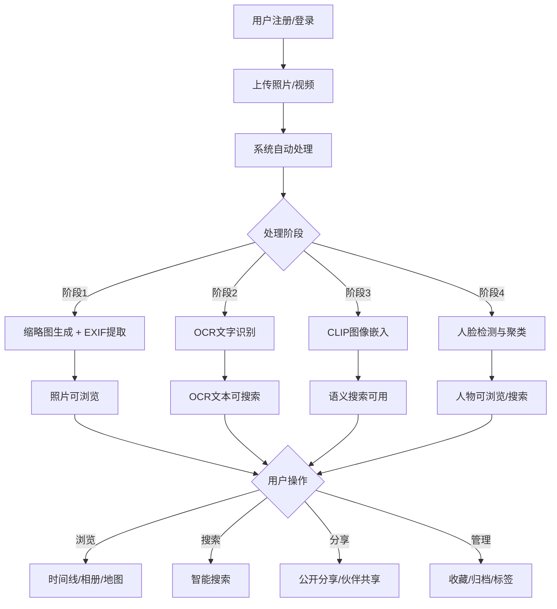

### 3.2 智能搜索流程
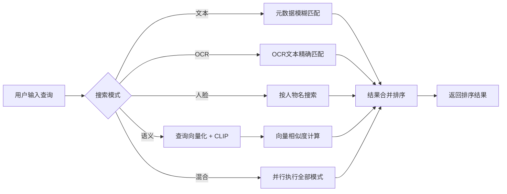

### 3.3 AI处理流水线
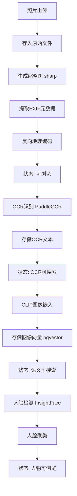

### 3.4 删除与回收站流程
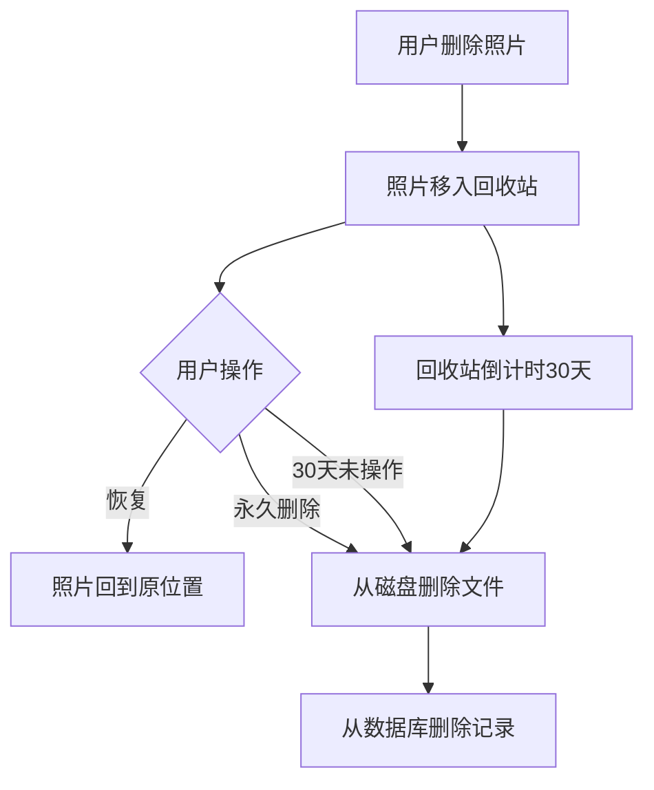

### 3.5 密码重置流程
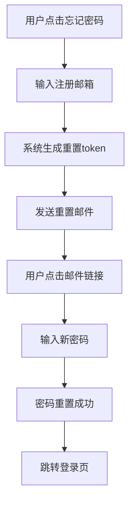

### 3.6 新用户引导流程
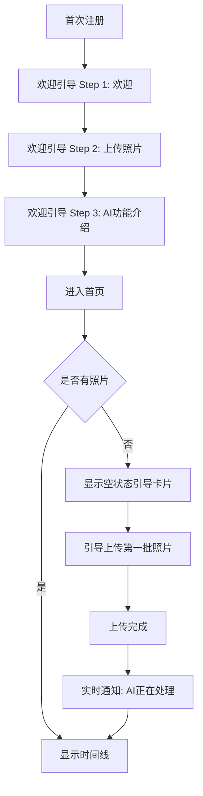

**Onboarding引导页详细设计：**
- Step 1 欢迎页: "欢迎使用AI Album" + 产品核心价值描述（隐私安全、智能搜索、人脸识别）+ "开始使用"按钮
- Step 2 上传引导: "上传你的第一批照片" + 拖拽区域 + 支持格式提示 + "跳过，稍后上传"链接
- Step 3 AI功能介绍: 三张卡片轮播介绍（智能搜索: "用自然语言搜索照片"、人脸识别: "自动识别和归类人物"、OCR识别: "搜索照片中的文字"）+ "开始体验"按钮
- 引导状态存储: localStorage `onboarding_completed=true`，完成后不再显示
- Admin首次登录额外引导: 系统配置提示（SMTP设置、存储配额、外部库配置）

### 3.7 外部库扫描流程
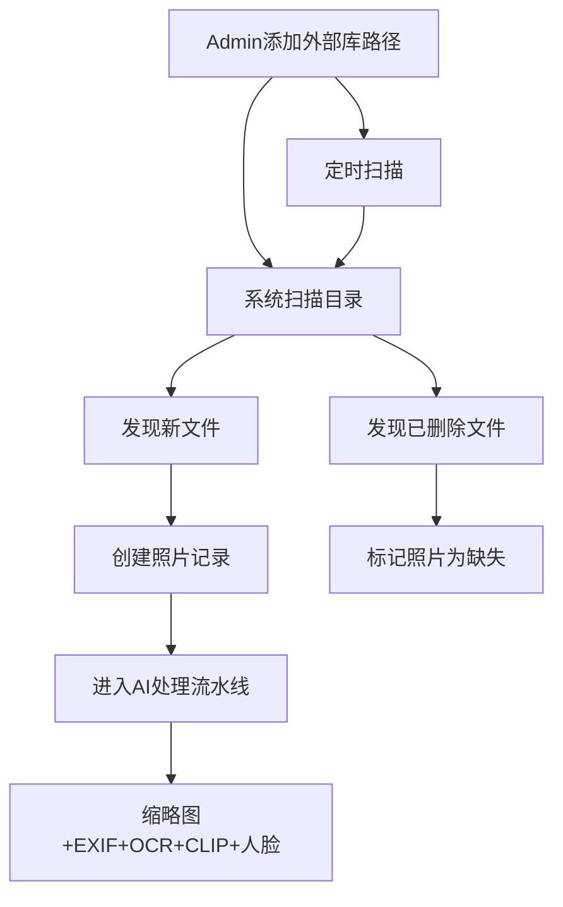

### 3.8 移动端自动备份流程
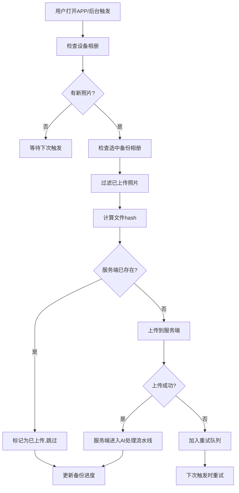

### 3.9 释放空间(Free Up Space)流程
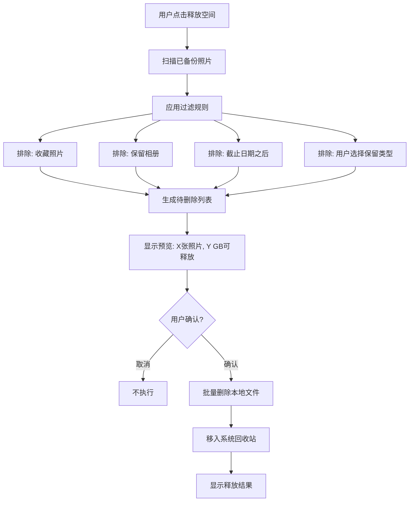

### 3.10 智能相册自动分类流程
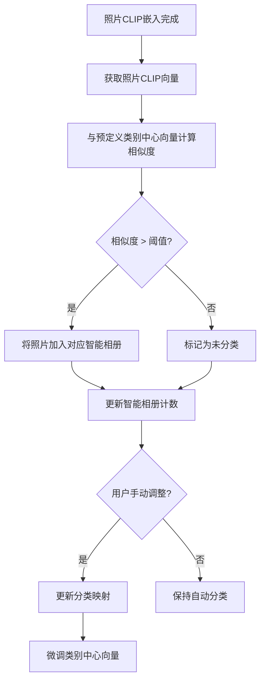

### 3.11 年度回顾生成流程
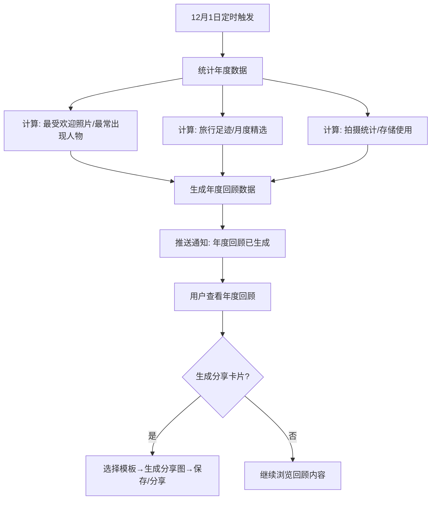

### 3.12 共享图库流程
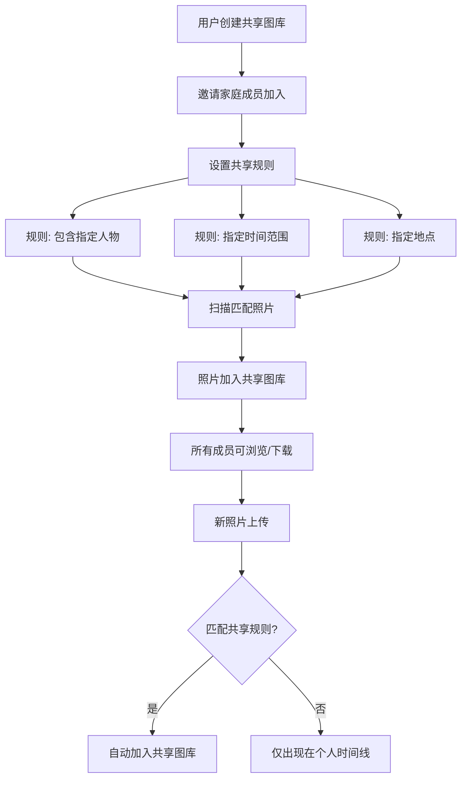

## 4. User Interface Design

### 4.1 Design Style
- **Primary color**: 深靛蓝 (#101014)，**Secondary color**: 柔和蓝 (#4361ee)，**Accent**: 琥珀色 (#f72585)
- **Dark theme优先**: 深色背景突出照片内容，参考immich的沉浸式照片浏览体验
- **Button style**: 圆角8px，轻微毛玻璃效果，hover时渐变发光
- **Font**: 标题使用 Outfit（几何感现代字体），正文使用 DM Sans（清晰可读）
- **Layout style**: 左侧紧凑导航栏 + 主内容区，照片采用Masonry瀑布流，参考immich的虚拟滚动
- **Icon style**: Lucide线性图标，24px，stroke-width 1.5
- **Card style**: 微透明背景 + backdrop-blur，subtle border，hover时轻微放大
- **Navigation**: 左侧垂直导航（桌面端），底部Tab导航（移动端），参考immich的导航结构
  - 桌面端导航项: 首页、探索、相册、智能分类、地图、搜索、收藏、归档、分享(含共享图库)、重复检测、管理(Admin)、设置
  - 移动端Tab: 首页、探索、相册、搜索、设置(更多)
  - 年度回顾入口: 首页Memories卡片 + 侧边栏快捷入口(12月显示红点提示)

### 4.2 Page Design Overview
| Page Name | Module Name | UI Elements |
|-----------|-------------|-------------|
| 首页 | 时间线 | Masonry瀑布流，顶部毛玻璃搜索栏，回忆卡片，Memories横向滚动卡片，右下角FAB上传按钮，排序下拉，右侧Scrubber导航条，视图切换(个人/共享图库) |
| 首页 | 批量操作 | 多选模式按钮，底部操作栏(收藏/归档/删除/加入相册) |
| 首页 | 搜索栏 | 居中搜索框，智能搜索(默认)，高级筛选折叠按钮，下拉搜索建议 |
| Onboarding | 引导步骤 | 全屏卡片，步骤指示器(1/3→2/3→3/3)，插图+标题+描述，下一步/跳过按钮 |
| 探索页 | 人物 | 圆形头像网格，hover显示名字和照片数，可合并/隐藏 |
| 探索页 | 地点 | 地图标记+列表，联动高亮 |
| 探索页 | 智能分类 | 分类卡片网格(封面+名称+计数)，自定义分类按钮，点击进入分类详情 |
| 相册页 | 相册列表 | 相册封面网格，照片计数徽标，创建按钮 |
| 地图页 | 全球地图 | 全屏Leaflet地图，聚类标记，点击弹出照片预览，右侧照片列表面板 |
| 搜索页 | 搜索结果 | 网格布局，每张照片角标显示匹配类型，高级筛选折叠面板，滚动加载更多 |
| 照片详情页 | 详情展示 | 全屏大图/视频播放器，底部抽屉式信息面板，人脸标注框，OCR文本可折叠 |
| 上传页 | 上传区域 | 虚线拖拽区，文件列表带阶段进度条，重复检测提示 |
| 管理页 | 任务队列 | 各队列状态卡片，暂停/恢复按钮，进度条 |
| 设置页 | 语言 | 语言下拉选择(中文/英文) |
| 智能相册 | 分类网格 | 分类卡片网格(宠物/食物/建筑/自然等)，每类显示封面+计数，支持多选筛选 |
| 年度回顾 | 回顾页面 | 全屏沉浸式滚动，年度数据可视化(图表+照片)，分享卡片生成器，模板选择 |
| 重复检测 | 重复管理 | 分组展示重复照片，每组标记推荐保留项，批量操作工具栏，相似度百分比 |
| 共享图库 | 图库管理 | 图库列表+成员头像，共享规则配置面板，自动共享开关，照片网格 |
| 虚拟滚动Scrubber | 导航条 | 右侧细长拖拽条，拖拽时弹出月份/年份标签，当前位置指示器 |

### 4.3 Responsiveness
- Desktop (≥1280px): 左侧导航 + 主内容区 + 可选右侧面板
- Tablet (768-1279px): 可折叠侧边栏 + 主内容区
- Mobile (<768px): 底部Tab导航 + 全屏内容区，搜索栏置顶

**移动端特殊交互:**
- 照片网格: 2-3列自适应，支持双指缩放切换网格密度
- 照片详情: 左右滑动切换照片，上滑拉起信息面板
- 批量操作: 长按照片进入多选模式，底部操作栏
- 上传: 支持相机拍照直接上传，支持从相册选择
- 搜索: 搜索框置顶固定，点击展开全屏搜索
- 下拉刷新: 首页支持下拉刷新照片列表
- 触觉反馈: 收藏/删除等操作触发轻微振动(navigator.vibrate)

### 4.4 Empty States & Error States

> 参考immich的错误处理和空状态设计理念：每个错误状态都提供明确的恢复路径，每个空状态都提供行动指引(CTA)。

#### 4.4.1 全局错误状态

| 场景 | 错误表现 | 交互行为 | 恢复路径 |
|------|----------|----------|----------|
| 网络断开 | 顶部红色横幅"网络连接已断开" | 横幅持续显示直到恢复；离线期间操作排队，恢复后自动执行 | 自动检测网络恢复，横幅变绿"已重新连接"后消失 |
| Session过期(401) | 弹出模态框"登录已过期" | 模态框阻止所有操作，点击"重新登录"跳转登录页 | 重新登录后回到之前页面 |
| 被踢下线(其他设备登出) | 弹出模态框"你的账户已在其他设备登录" | 同上 | 重新登录 |
| 服务器维护(503) | 全屏维护页面"系统维护中，请稍后" | 显示预计恢复时间(如有)；自动每30秒重试 | 检测到服务恢复后自动刷新 |
| 服务器错误(500) | Toast (error) "服务器错误，请稍后重试" | 操作失败但不阻断页面；3次连续500显示"服务异常"横幅 | 用户可手动重试操作 |
| 请求限流(429) | Toast (warning) "操作过于频繁，请稍后再试" | 按钮进入3秒冷却期(灰色不可点击) | 冷却期后自动恢复 |
| 权限不足(403) | Toast (error) "你没有权限执行此操作" | 操作按钮置灰或隐藏 | 联系管理员 |
| 资源不存在(404) | 404页面"页面不存在" | 提供"返回首页"按钮 | 点击返回首页 |
| 数据冲突(409) | Toast (warning) "数据已被修改，请刷新后重试" | 自动刷新数据 | 刷新后重试操作 |
| 请求超时 | Toast (error) "请求超时，请检查网络" | 提供重试按钮 | 点击重试 |

#### 4.4.2 认证相关错误状态

| 场景 | 错误表现 | 交互行为 | 恢复路径 |
|------|----------|----------|----------|
| 邮箱已注册(409) | 邮箱输入框下方红色提示"该邮箱已注册" | 提供"直接登录"链接 | 点击跳转登录页 |
| 密码错误(401) | 密码输入框下方红色提示"密码错误" | 3次失败后显示"忘记密码？"链接 | 点击跳转密码重置 |
| 密码重置token过期 | 页面提示"链接已过期，请重新申请" | 提供"重新发送重置邮件"按钮 | 点击重新发送 |
| 密码重置token无效 | 页面提示"链接无效" | 提供"返回登录页"按钮 | 点击返回登录 |
| 2FA验证码错误 | 输入框下方红色提示"验证码错误" | 3次失败后提示"使用恢复码" | 输入恢复码或等待1分钟重试 |
| 2FA验证码过期 | 输入框下方红色提示"验证码已过期，请重新获取" | 自动聚焦输入框 | 等待新验证码生成 |
| 账户被禁用 | 登录时提示"账户已被禁用，请联系管理员" | 不提供其他操作 | 联系管理员 |
| 公开注册已关闭 | 注册页提示"当前不支持公开注册" | 提供"联系管理员"链接 | 联系管理员获取邀请 |

#### 4.4.3 上传与处理错误状态

| 场景 | 错误表现 | 交互行为 | 恢复路径 |
|------|----------|----------|----------|
| 文件过大(>200MB) | 文件列表红色标记"文件超过200MB限制" | 跳过该文件，继续上传其他文件 | 压缩后重新上传 |
| 不支持的格式 | 文件列表红色标记"不支持的文件格式" | 显示支持格式列表tooltip | 选择正确格式 |
| 重复文件 | 文件列表黄色标记"文件已存在" | 默认跳过，可手动选择覆盖 | 跳过或覆盖 |
| 上传中断(网络) | 文件列表显示"上传暂停"+黄色暂停图标 | 自动暂停，网络恢复后自动继续 | 等待网络恢复或手动重试 |
| 上传失败(服务端) | 文件列表红色标记"上传失败"+重试按钮 | 单文件失败不影响其他文件 | 点击重试按钮 |
| 存储配额满(>95%) | 弹出模态框"存储空间不足" | 阻止继续上传 | 清理照片/联系管理员扩容 |
| AI处理-缩略图失败 | 照片显示默认占位图+红色"处理失败"标签 | 照片仍可浏览原图，仅缩略图缺失 | 点击"重新处理"按钮 |
| AI处理-OCR失败 | 详情页OCR区域显示"OCR识别失败"+重试按钮 | 照片浏览和搜索不受影响，仅OCR不可用 | 点击重试 |
| AI处理-CLIP失败 | 详情页无语义搜索提示 | 文本/OCR搜索仍可用，语义搜索不可用 | 管理页重试CLIP任务 |
| AI处理-人脸失败 | 探索页人物区域无此照片的人脸 | 其他AI功能不受影响 | 管理页重试人脸任务 |
| ML服务不可用 | 管理页显示"ML服务离线"红色状态 | 新上传照片仅生成缩略图，AI任务排队等待 | 重启ML服务，排队任务自动执行 |
| 照片编辑失败 | Toast (error) "编辑失败: 原因"+重试按钮 | 原图不受影响 | 点击重试 |
| 批量下载打包失败 | Toast (error) "打包失败"+重试按钮 | 不影响照片数据 | 点击重试 |

#### 4.4.4 分享与协作错误状态

| 场景 | 错误表现 | 交互行为 | 恢复路径 |
|------|----------|----------|----------|
| 分享链接过期 | 页面显示"链接已过期" | 提示"请联系分享者获取新链接" | 联系分享者 |
| 分享链接密码错误 | 输入框下方红色提示"密码错误" | 密码框清空，聚焦 | 重新输入密码 |
| 分享内容已删除 | 页面显示"分享内容不存在" | 提供"返回"按钮 | 返回上一页 |
| 伙伴共享被取消 | Toast (info) "共享已被取消" | 共享照片从时间线移除 | 无需操作 |
| 共享图库成员退出 | 通知"XXX已退出共享图库" | 其照片从图库移除 | 无需操作 |
| 协作者权限不足 | Toast (error) "你不是此相册的协作者" | 操作按钮置灰 | 联系相册创建者 |

#### 4.4.5 移动端特有错误状态

| 场景 | 错误表现 | 交互行为 | 恢复路径 |
|------|----------|----------|----------|
| 服务器连接失败 | 设置页红色提示"无法连接到服务器" | 提供"测试连接"按钮 | 检查URL/网络后重试 |
| HTTPS证书无效 | 弹出警告"证书验证失败" | 提供"查看详情"和"继续(不安全)"选项 | 修复证书或选择继续 |
| 后台备份失败 | 通知栏"备份失败"+红色云图标 | 下次打开APP时显示失败原因 | 打开APP自动重试 |
| 本地存储不足 | 弹出"手机存储空间不足" | 提供"释放空间"快捷入口 | 释放空间后继续备份 |
| 相册权限被拒绝 | 备份页提示"需要相册访问权限" | 提供"前往设置"按钮 | 系统设置中授权 |
| 后台刷新被禁用(iOS) | 设置页提示"请开启Background App Refresh" | 提供"前往设置"按钮 | 系统设置中开启 |
| 电池优化限制(Android) | 设置页提示"请关闭电池优化" | 提供"前往设置"按钮 | 系统设置中关闭 |
| GPS权限被拒绝(地图) | 地图页提示"需要位置权限显示附近照片" | 提供"前往设置"按钮 | 系统设置中授权 |
| 相机权限被拒绝 | 手动上传提示"需要相机权限" | 提供"前往设置"按钮 | 系统设置中授权 |

#### 4.4.6 商业化功能错误状态 (Phase 5)

| 场景 | 错误表现 | 交互行为 | 恢复路径 |
|------|----------|----------|----------|
| 支付失败(Stripe) | Toast (error) "支付失败: 原因" | 提供"重试支付"按钮 | 重新支付 |
| 支付超时 | 页面提示"支付结果确认中" | 自动轮询支付状态(最多5次) | 等待确认或联系客服 |
| 订阅已过期 | 顶部黄色横幅"订阅已过期，部分功能受限" | 提供"续费"按钮 | 续费后功能恢复 |
| AI功能配额用尽 | Toast (warning) "本月AI处理配额已用尽" | 提供"升级计划"链接 | 升级计划或等待下月 |
| 存储配额按计划限制 | 上传时Toast (warning) "已达到当前计划存储上限" | 提供"升级计划"链接 | 升级计划或清理空间 |
| 邀请码无效 | 输入框下方红色提示"邀请码无效" | 清空输入框，聚焦 | 输入正确邀请码 |

#### 4.4.7 空状态定义

> 参考immich设计：每个空状态包含插图、主文案、副文案、CTA按钮，引导用户完成首次操作。

| 页面/场景 | 空状态插图 | 主文案 | 副文案 | CTA按钮 |
|-----------|-----------|--------|--------|---------|
| 首页-无照片 | 📷 相机插图 | 上传你的第一张照片 | 拖拽文件到此处或点击上传按钮开始 | "上传照片" |
| 首页-无回忆 | - | (不显示回忆区域) | - | - |
| 首页-Memories无数据 | - | (不显示Memories卡片区域) | - | - |
| 搜索-无结果 | 🔍 放大镜插图 | 未找到匹配照片 | 试试其他关键词，或使用自然语言描述搜索 | "高级搜索" |
| 搜索-无历史 | - | (不显示搜索历史区域) | - | - |
| 探索-人物为空 | 👤 人脸插图 | 上传含人脸的照片 | AI将自动识别和归类照片中的人物 | "上传照片" |
| 探索-地点为空 | 📍 地图插图 | 上传含位置信息的照片 | 开启手机GPS拍摄，照片将自动标记位置 | "上传照片" |
| 探索-标签为空 | 🏷️ 标签插图 | 创建你的第一个标签 | 标签帮助你快速筛选和查找照片 | "创建标签" |
| 探索-智能分类为空 | 🤖 AI插图 | 上传更多照片以启用智能分类 | AI将自动将照片分类到宠物、食物、自然等类别 | "浏览照片" |
| 相册-无相册 | 📁 相册插图 | 创建你的第一个相册 | 按主题组织你的照片，方便浏览和分享 | "创建相册" |
| 相册详情-空相册 | 🖼️ 照片插图 | 这个相册还没有照片 | 从时间线添加照片到相册 | "添加照片" |
| 收藏夹-空 | ⭐ 星星插图 | 收藏你的第一张照片 | 浏览照片时点击星标即可收藏 | "浏览照片" |
| 归档-空 | 📦 归档插图 | 没有归档的照片 | 归档照片不会出现在主时间线，但仍然可以搜索到 | "浏览照片" |
| 回收站-空 | 🗑️ 回收站插图 | 回收站是空的 | 删除的照片会在这里保留30天 | - |
| 地图-无GPS照片 | 🌍 地球插图 | 没有含位置信息的照片 | 上传含GPS数据的照片，在地图上查看你的旅行足迹 | "上传照片" |
| 分享-无分享 | 🔗 链接插图 | 还没有分享链接 | 创建分享链接，让朋友查看你的照片 | "创建分享" |
| 共享图库-无图库 | 👨‍👩‍👧‍👦 家庭插图 | 邀请家庭成员加入共享图库 | 所有成员的照片将自动汇聚到共享图库 | "创建图库" |
| 共享图库-无照片 | 📸 照片插图 | 共享图库为空 | 设置共享规则，符合条件的照片将自动添加 | "设置规则" |
| 重复检测-无结果 | ✅ 对勾插图 | 没有发现重复照片 | 你的照片库很整洁！ | - |
| 智能相册-空分类 | 🧩 拼图插图 | 上传更多照片以启用智能分类 | AI将根据照片内容自动创建分类相册 | "上传照片" |
| 年度回顾-未生成 | 📅 日历插图 | 年度回顾将在12月生成 | 年底时系统将自动为你生成年度照片回顾 | - |
| 年度回顾-无数据 | 📊 图表插图 | 今年还没有照片 | 上传照片后，年底将生成你的年度回顾 | "上传照片" |
| 管理页-无用户(仅Admin) | 👥 用户插图 | 还没有其他用户 | 邀请朋友注册，一起使用AI Album | "创建用户" |
| 管理页-无外部库 | 💾 硬盘插图 | 还没有外部库 | 挂载NAS或外部目录，直接浏览照片 | "添加外部库" |
| 管理页-队列空闲 | ✅ 对勾插图 | 所有任务已完成 | 当前没有等待处理的任务 | - |
| 通知-无通知 | 🔔 铃铛插图 | 没有新通知 | 处理完成、分享更新等通知将显示在这里 | - |
| 设置-API密钥为空 | 🔑 钥匙插图 | 还没有API密钥 | 创建API密钥用于CLI工具或第三方集成 | "创建密钥" |
| 数据导入-无任务 | 📥 导入插图 | 还没有导入任务 | 从Google Photos或immich导入你的照片 | "开始导入" |

#### 4.4.8 空状态设计规范

- **插图**: 使用品牌色(#4361ee)线条风格SVG插图，与暗色主题协调
- **主文案**: 16px DM Sans Medium，白色(#ffffff)
- **副文案**: 14px DM Sans Regular，灰色(#94a3b8)
- **CTA按钮**: 圆角8px，品牌色背景(#4361ee)，白色文字，hover时发光效果
- **布局**: 垂直居中，插图(80x80px) → 主文案 → 副文案 → CTA按钮，间距16px
- **动画**: 插图淡入(300ms) + 轻微上下浮动(2s循环，3px幅度)
- **暗色/亮色主题**: 暗色主题使用上述规范，亮色主题主文案改为#1e293b，副文案改为#64748b

### 4.5 Notification & Feedback

| 场景 | 反馈方式 | 内容 |
|------|----------|------|
| 上传成功 | Toast (success) | "X张照片上传成功" |
| 上传失败 | Toast (error) | "上传失败: 原因" |
| 收藏/取消 | Toast (success) | "已收藏" / "已取消收藏" |
| 删除照片 | Toast (success) | "照片已移入回收站" |
| 永久删除 | Toast (success) | "照片已永久删除" |
| 恢复照片 | Toast (success) | "照片已恢复" |
| AI处理完成 | 实时推送通知 (SSE) + 浏览器通知 | "3张照片AI处理完成" |
| AI处理失败 | 实时推送通知 (SSE) | "1张照片处理失败" + 重试链接 |
| AI处理进度 | 实时推送 (SSE) | 上传页实时更新各阶段进度 |
| 分享链接复制 | Toast (success) | "链接已复制" |
| 密码修改成功 | 跳转登录页 | "密码已修改，请重新登录" |
| 密码重置成功 | 跳转登录页 | "密码已重置，请登录" |
| 存储空间不足 | Toast (warning) | "存储空间不足，请联系管理员" |
| 操作确认(删除) | 确认对话框 | "确定要删除这张照片吗？照片将移入回收站" |
| 操作确认(永久删除) | 确认对话框 | "确定要永久删除吗？此操作不可撤销" |
| 操作确认(删除账户) | 确认对话框 + 输入密码 | "确定要删除账户吗？所有数据将被清除" |
| 批量操作完成 | Toast (success) | "已对X张照片执行操作" |
| 照片编辑保存 | Toast (success) | "编辑已保存" |
| 批量下载开始 | Toast (success) | "正在打包X张照片..." |
| 批量下载完成 | Toast (success) | "下载已开始" |
| 智能相册分类完成 | 实时推送 (SSE) | "X张新照片已自动分类" |
| 年度回顾已生成 | 推送通知 + 首页卡片 | "你的2024年度回顾已生成" |
| 重复检测完成 | Toast (success) | "发现X组重复照片" |
| 共享图库新照片 | 实时推送 (SSE) | "共享图库新增X张照片" |
| 共享图库成员加入 | Toast (success) | "XXX已加入共享图库" |

### 4.6 AI Features Description

#### 4.6.1 OCR识别功能
- 上传后自动触发OCR处理，作为AI处理流水线的第二阶段
- 使用PaddleOCR引擎，支持印刷体和手写体文字识别
- 支持中文（简/繁）、英文、日文等多语言，可在设置中配置首选语言
- 识别结果存储到数据库，支持全文检索（GIN索引 + tsvector）
- 照片详情页展示OCR文本，支持一键复制
- 搜索时OCR文本高亮显示匹配关键词
- OCR失败不影响照片浏览，仅OCR搜索不可用

#### 4.6.2 CLIP语义搜索
- 使用XLM-Roberta-Large-Vit-B-16Plus模型（多语言CLIP模型，支持中文语义搜索）对图像生成640维向量嵌入
- 用户输入自然语言描述即可搜索相关照片（如"海边的日落"）
- 支持跨语言语义理解（中文查询可匹配中文场景）
- 向量存储在pgvector中，使用HNSW索引实现高效相似度搜索
- 与OCR文本搜索和元数据搜索组合为混合搜索模式
- CLIP处理失败不影响其他功能
- 注意：默认的ViT-B-32::openai模型不支持中文语义搜索，必须使用XLM-Roberta-Large-Vit-B-16Plus或类似的多语言CLIP模型才能实现中文查询匹配中文场景

#### 4.6.3 人脸识别与聚类
- 使用InsightFace SCRFD模型自动检测照片中的人脸
- 使用人脸嵌入向量进行聚类，将同一人的照片归组
- 用户可为人物命名、设置特征照、合并/隐藏人物
- 支持按人物名搜索该人物的所有照片
- 照片详情页显示识别到的人脸，可手动标注
- 人脸检测失败不影响其他功能

#### 4.6.4 智能搜索功能
- **智能搜索（默认模式）**: 用户输入查询后，系统自动判断查询意图并执行最优搜索策略。短关键词（≤3字）优先文本/OCR匹配，自然语言描述优先语义搜索，人名优先人脸搜索。用户无需手动选择搜索模式
- **高级搜索模式**: 搜索结果页提供"高级筛选"折叠面板，允许用户手动指定搜索模式（文本/OCR/语义/人脸）和筛选条件（时间范围/收藏/归档/人物/标签）
- **文本搜索**: 基于文件名、地点名、人物名、标签等元数据的模糊匹配
- **OCR匹配**: 在OCR识别文本中进行关键词精确匹配和模糊匹配
- **语义搜索**: 将用户查询通过CLIP模型转为向量，与照片嵌入向量计算余弦相似度
- **人脸搜索**: 按人物名搜索该人物出现的所有照片
- **混合搜索**: 并行执行文本+OCR+语义+人脸搜索，按加权分数合并排序（权重: text=0.2, ocr=0.3, semantic=0.4, face=0.1）
- 搜索结果展示匹配类型标签和相关性分数
- 支持搜索历史记录，自动保存最近50条
- 输入300ms防抖后触发搜索
- 搜索框聚焦时显示搜索历史和热门搜索建议
- 搜索结果分页加载，每页20条，滚动加载更多
- **搜索建议**: 输入时自动补全人物名、地点名、标签名

#### 4.6.5 AI处理流程
- 照片上传后进入BullMQ任务队列，按优先级顺序处理
- 四阶段流水线：缩略图生成 → OCR识别 → CLIP嵌入 → 人脸检测
- 每阶段独立状态追踪，失败可单独重试
- **实时状态推送**: 使用SSE(Server-Sent Events)向前端推送处理进度，无需轮询
  - 连接端点: GET /api/events (需认证)
  - 事件类型: processing-progress(阶段进度), processing-complete(处理完成), processing-failed(处理失败)
  - 前端自动重连: 断线后3秒重连，重连后补发missed事件
- 管理员可在管理页查看全局处理队列状态，暂停/恢复/重试
- 支持手动触发重新处理某张照片
- 任意阶段失败不影响已完成阶段的功能
- 视频文件仅生成缩略图和提取元数据，不执行OCR/CLIP/人脸
- **浏览器通知**: AI处理完成后，若用户不在当前标签页，发送浏览器通知(Notification API)，需用户授权

#### 4.6.6 重复检测
- 上传时计算文件哈希（SHA-256）
- 检测到完全相同的文件时提示用户跳过
- 不自动删除，由用户决定

#### 4.6.7 反向地理编码
- 根据照片GPS坐标自动获取地点名称
- 使用坐标缓存策略：相同区域（小数点后1位）复用已有地名
- 生产环境推荐部署本地Nominatim服务
- 地点名称用于分类浏览和搜索
- 无GPS坐标的照片不进行地理编码

#### 4.6.8 时间轨迹与回忆
- 时间轴视图：垂直时间线，按拍摄日期排列照片
- 地图轨迹：在地图上标注拍摄地点，连线形成旅行路线
- 回忆功能："X年前的今天"自动推送，参考immich的Memories功能
- 支持按时间段筛选浏览

#### 4.6.9 智能相册自动分类
- 利用CLIP向量与预定义类别中心向量计算余弦相似度，自动将照片分类到智能相册
- **预定义分类类别**: 宠物/猫/狗、食物/美食、建筑/城市、自然/风景、车辆/汽车、运动/健身、旅行/旅游、人物/肖像、花卉/植物、天空/日落、海滩/海洋、山脉/山景、雪景/冬季、文档/文字
- **分类原理**: 每个类别预计算一个中心向量(由该类别多个样本的CLIP向量取平均)，新照片的CLIP向量与所有类别中心计算相似度，最高相似度超过阈值(0.3)则归入该类别
- **自动更新**: 新照片CLIP嵌入完成后自动触发分类，无需手动操作
- **用户可调整**: 用户可将照片从一个分类移到另一个，系统记录调整并微调类别中心
- **自定义类别**: 用户可创建自定义分类，通过提供3-5张样本照片计算类别中心向量
- **多分类归属**: 一张照片可同时属于多个分类(如一张在海边吃海鲜的照片可同时属于"食物"和"海滩")
- **分类页面**: 探索页新增"智能分类"Tab，按类别网格展示
- **与手动相册区别**: 智能相册由AI自动维护，不可手动添加/移除照片(只能调整分类)，手动相册由用户完全控制

#### 4.6.10 年度回顾生成
- 每年12月1日自动生成本年度照片回顾报告，参考Google Photos Recap和Spotify Wrapped
- **回顾内容**:
  - 年度精选: 基于收藏数、查看数、分享次数评选Top 10照片
  - 人物回顾: 最常出现的人物及其照片数
  - 旅行足迹: 年度去过的地点地图，按时间线展示
  - 月度精选: 每月1张最佳照片(基于EXIF评分/收藏/分辨率)
  - 拍摄统计: 总照片数、总视频数、总存储、最常使用的相机/镜头
  - 时间分布: 按月/按星期/按时段的拍摄分布图
- **分享卡片**: 生成精美分享图，支持多种模板风格(极简/杂志/拼图)，一键保存到相册或分享到社交平台
- **隐私控制**: 用户可选择排除特定人物或时间范围的照片，分享卡片不包含位置信息(可配置)
- **历史回顾**: 支持查看过去年份的年度回顾
- **触发方式**: 12月1日定时生成 + 用户可手动触发重新生成
- **通知推送**: 生成完成后通过SSE和浏览器通知提醒用户

#### 4.6.11 Memories自动回忆集
- 自动生成主题回忆集，参考Apple Photos的Memories功能
- **回忆类型**:
  - 周年纪念: "1年前的今天"、"3年前的这个月"
  - 主题回忆: "夏日时光"、"冬日雪景"、"旅行回忆"等基于CLIP分类自动生成
  - 人物回忆: "与小明的美好时光"等基于人脸识别自动生成
  - 地点回忆: "北京之旅"等基于GPS聚类自动生成
- **展示方式**: 首页顶部横向滚动卡片，点击进入全屏幻灯片浏览
- **自动管理**: 回忆集自动生成和过期，用户可保存喜欢的回忆集
- **生成算法**:
  - 周年纪念: 每日定时任务查询taken_at在1/2/3...年前同一天(±3天)的照片，至少5张才生成
  - 主题回忆: 基于CLIP向量聚类，将同一语义类别的照片聚合，至少10张生成
  - 人物回忆: 基于person_id分组，选取某人物出现频率最高的时间段，至少5张生成
  - 地点回忆: 基于location_name分组(同一城市)，选取照片数量最多的旅行，至少5张生成
- **过期策略**: 周年纪念回忆30天后过期，主题/人物/地点回忆90天后过期，用户保存的回忆不过期
- **音乐配乐**: 幻灯片播放时可选背景音乐(内置免版权音乐)

### 4.7 多用户与分享

#### 4.7.1 多用户支持
- 支持多用户注册和使用
- 每个用户有独立的照片库和相册
- 管理员可管理用户、设置存储配额
- 首个注册用户自动成为Admin
- 支持同一邮箱多设备同时登录
- 修改密码后其他设备token不失效（JWT无状态），但可在设置页"退出所有设备"
- 支持API Key认证方式，用于CLI工具和第三方集成

#### 4.7.2 公开分享
- 生成分享链接，无需登录即可查看
- 可设置过期时间
- 可设置访问密码
- 分享链接可包含单张照片或整个相册
- 分享页面不显示其他用户的照片
- 分享页面底部显示"由AI Album提供"

#### 4.7.3 伙伴共享
- 指定用户共享全部或部分照片
- 伙伴可在自己的时间线中看到共享的照片
- 支持单向共享（可随时取消）

#### 4.7.4 共享图库
- 创建家庭共享图库，邀请家庭成员加入，参考Google Photos和Apple Photos的共享图库功能
- **与伙伴共享的区别**: 伙伴共享是单向的(共享者→被共享者)，共享图库是双向的(所有成员的照片自动汇聚)
- **共享规则**: 创建者可设置自动共享规则
  - 包含指定人物: 包含某人的照片自动加入图库
  - 指定时间范围: 某时间段内的照片自动加入图库
  - 指定地点: 某地点的照片自动加入图库
  - 全部共享: 所有照片自动加入图库
- **成员管理**: 创建者可邀请/移除成员，成员可主动退出
- **权限控制**: 所有成员可浏览和下载，仅创建者和照片所有者可删除
- **自动同步**: 新照片上传后自动匹配规则，符合规则的照片自动加入共享图库
- **存储计算**: 共享图库中的照片存储计入原始上传者配额，不计入其他成员配额
- **图库浏览**: 成员可在首页切换"个人"/"共享图库"视图

### 4.8 其他功能
- **收藏与归档**: 收藏照片快速访问，归档照片不在主时间线显示但仍可搜索
- **标签系统**: 用户自定义标签，按标签筛选照片
- **批量操作**: 多选照片批量收藏/归档/删除/添加到相册
- **回收站**: 删除照片进入回收站，30天自动清除，可手动恢复或永久删除
- **密码重置**: 通过邮箱重置密码
- **账户删除**: 用户可删除自己的账户及所有数据
- **排序选项**: 时间线支持按时间/名称/大小排序
- **API密钥**: 创建API密钥用于CLI或第三方集成（Phase 4）
- **OAuth登录**: 支持GitHub/Google等第三方登录（Phase 4）
- **存储模板**: 自定义文件存储路径格式（Phase 4）
- **照片堆叠(Stack)**: 自动将连拍、RAW+JPEG配对、相似照片堆叠显示，展开可查看组内所有照片
- **照片编辑**: 基础图片编辑功能（裁剪、旋转、翻转、亮度/对比度/饱和度调整、预设滤镜），编辑后保存为新版本，原图保留可恢复
- **批量下载**: 相册或选中照片打包为ZIP下载，支持选择原始尺寸或缩略图尺寸
- **幻灯片播放**: 相册或搜索结果的全屏幻灯片模式，支持自动播放(可设间隔3/5/10秒)、手动翻页、全屏
- **数据导入**: 支持从Google Photos(Takeout)、immich导出数据、目录结构导入照片，保留EXIF和目录结构信息
- **首次部署引导**: ML模型下载进度实时显示，系统初始化状态页面，SMTP配置引导
- **用户数据导出**: 用户可在设置页请求导出个人全部数据(照片原始文件+元数据JSON+相册结构+标签)，生成ZIP下载，参考GDPR数据可携带权
- **immich迁移工具**: 专用迁移脚本，从immich数据库导出用户/照片/相册/人脸数据，转换格式后导入AI Album，保留相册结构和人物命名
- **Google Photos迁移增强**: 解析Takeout ZIP中的metadata.json，保留描述/地理位置/相册信息，自动匹配已有照片避免重复
- **版本更新检查**: 系统定期检查GitHub Releases新版本，Admin管理页显示更新提示和changelog，一键升级
- **LivePhoto/MotionPhoto**: 支持Apple LivePhoto(JPEG+MOV配对)和Samsung/Google MotionPhoto，浏览时长按播放动态效果，时间线显示动态标识
- **XMP Sidecar**: 支持读取XMP侧边文件中的元数据（标签、评分、描述），专业用户从Lightroom等工具导入时保留编辑信息
- **只读/儿童模式**: 移动端可切换为只读模式，防止误删除，适合儿童使用或展示场景
- **离线浏览**: 移动端缓存已浏览的缩略图，无网络时可浏览已缓存内容
- **虚拟滚动Scrubber**: 时间线右侧快速导航拖拽条，拖拽时显示月份/年份标签，松手跳转，支持缩放调整精度(月/年)，移动端左侧边缘滑动触发
- **重复检测管理**: 专门的重复照片管理页面，区分完全重复(相同hash)和相似照片(视觉相似)，按相似度分组，自动推荐保留最佳版本，支持批量删除
- **精选照片**: AI自动从连拍/同场景照片中推荐最佳照片(基于清晰度/构图/表情评分)，在照片详情页和相册页显示"精选"标识
- **活动日志**: 记录用户关键操作(登录/上传/删除/分享/修改设置)，Admin可查看所有用户日志，普通用户可查看自己的日志

### 4.9 移动端APP详细设计

#### 4.9.1 移动端技术方案
- **框架**: Flutter (Dart)，参考immich移动端架构
- **发布渠道**: Google Play Store + Apple App Store + GitHub Releases (APK) + F-Droid
- **最低版本**: Android 8.0 (API 26) / iOS 15.0
- **状态管理**: Riverpod
- **本地存储**: Hive (键值存储) + Isar (本地照片索引)
- **网络**: Dio (HTTP客户端)
- **图片缓存**: cached_network_image
- **后台任务**: workmanager (Android/iOS后台备份)

#### 4.9.2 移动端核心功能
- **服务器连接**: 输入服务器URL → 验证连接 → 邮箱密码登录 → 保存凭据
- **前台备份**: APP打开/恢复时自动检测新照片 → 仅上传选中相册 → 显示备份进度
- **后台备份**: 定期检测新照片并上传，Android使用WorkManager，iOS使用BGTaskScheduler
- **选择性相册**: 显示设备所有相册列表，用户勾选要备份的相册
- **释放空间**: 扫描已备份照片 → 应用过滤规则(截止日期/保留收藏/保留相册) → 预览确认 → 批量删除本地文件到系统回收站
- **相册同步**: 设备相册自动映射到服务端同名相册，单向同步
- **离线浏览**: 缓存最近浏览的缩略图，离线时显示缓存指示器
- **只读模式**: 禁止删除/编辑操作，仅允许浏览和搜索
- **存储指示器**: 照片网格中显示云图标标识同步状态(已同步/仅本地)
- **手动上传**: 选择本地照片手动上传，不依赖自动备份
- **智能分类浏览**: 浏览AI自动分类的照片，按类别查看
- **年度回顾**: 查看年度照片回顾报告，生成分享卡片
- **重复检测**: 检测和管理重复照片，释放存储空间
- **共享图库**: 浏览家庭共享图库，查看其他成员共享的照片

## 5. Non-Functional Requirements

### 5.1 硬件需求
| 配置项 | 最低要求 | 推荐配置 |
|--------|----------|----------|
| CPU | 2核 ARM64/x86_64 | 4核+ |
| RAM | 4GB | 6GB+ |
| 存储 | 系统盘20GB + 数据盘 | SSD系统盘 + 大容量数据盘 |
| GPU | 无(纯CPU推理) | 可选: 支持CUDA/OpenCL加速ML推理 |
| 网络 | 局域网 | 宽带(支持远程访问) |

**说明：**
- ML推理默认使用CPU，4GB RAM可运行但CLIP推理较慢(约5-10秒/张)
- 6GB+ RAM可同时运行所有ML模型而不触发OOM
- 照片存储应使用独立数据盘，便于备份和扩容
- GPU加速为可选功能，可显著提升ML推理速度

### 5.2 一键安装体验
- **安装脚本**: 提供install.sh一键安装脚本，自动检测环境、安装Docker、拉取镜像、初始化配置
- **安装流程**: curl -fsSL install-url \| bash → 检测Docker → 拉取镜像 → 生成.env → 启动服务 → 显示访问地址
- **安装脚本功能**:
  - 自动检测操作系统和架构(ARM64/x86_64)
  - 自动安装Docker和Docker Compose(如未安装)
  - 自动生成随机JWT_SECRET和数据库密码
  - 自动创建上传目录和缩略图目录
  - 自动配置防火墙规则(开放80/443端口)
  - 安装完成后显示访问URL和默认管理员创建提示
- **首次启动Web配置向导**: 首次访问系统时显示配置向导页面(无需命令行)
  - Step 1: 创建管理员账户(邮箱/密码/昵称)
  - Step 2: 配置存储路径(默认/app/uploads，可修改)
  - Step 3: 配置SMTP邮件(可选，跳过则密码重置功能不可用)
  - Step 4: ML模型下载进度(显示各模型下载状态)
  - Step 5: 完成配置，进入系统
  - 配置状态存储在数据库config表，向导完成后不再显示
- **升级脚本**: 提供upgrade.sh一键升级，自动备份数据库→拉取新镜像→执行迁移→重启服务
- **卸载脚本**: 提供uninstall.sh，可选择是否保留数据

### 5.3 性能要求
| 指标 | 目标值 | 大数据量目标(10k+照片) |
|------|--------|----------------------|
| 首页加载时间 | ≤2秒 (100张照片) | ≤3秒 (10k+照片) |
| 搜索响应时间 | ≤1秒 (文本/OCR), ≤3秒 (语义) | ≤2秒 (文本/OCR), ≤5秒 (语义) |
| 照片上传吞吐 | ≥10张/分钟 (单用户) | ≥10张/分钟 |
| 缩略图生成 | ≤2秒/张 | ≤2秒/张 |
| API响应时间 | ≤500ms (非AI接口) | ≤800ms (非AI接口) |
| 前端渲染 | 60fps滚动，虚拟滚动无卡顿 | 60fps滚动，虚拟滚动无卡顿 |
| 视频缩略图生成 | ≤5秒/个 | ≤5秒/个 |
| 智能相册分类 | ≤100ms/张 (CLIP向量已存在) | ≤100ms/张 |
| 重复检测扫描 | ≤30秒 (1k照片) | ≤5分钟 (10k照片) |
| 年度回顾生成 | ≤10秒 | ≤30秒 (10k+照片) |
| 数据库查询(时间线) | ≤200ms | ≤500ms |

**性能架构保障（详见arch.md第9-11章）:**
- 数据库连接池: max=15(可配置DB_POOL_MAX), min=2, 自动回收泄漏连接
- ML批处理: 单次最多16张照片，减少HTTP开销
- 多级缓存: 浏览器缓存(1年缩略图) + Redis应用缓存(5min搜索) + PG物化视图
- 查询优化: covering index + CTE + pgvector HNSW索引(m=16, ef_search=100)
- 数据库分区: activity_logs按月分区，photos按年分区(10万+时启用)
- 存储抽象: IStorageProvider接口，缩略图本地+原图可S3
- 水平扩展: API Server无状态可多实例，Worker通过BullMQ保证消费幂等
- 熔断器: ML服务熔断保护(cockatiel, 5次失败/60秒熔断, 30秒半开)
- 优雅关闭: SIGTERM后等待进行中任务完成(最多60秒)

### 5.4 安全要求
- 所有API通信必须通过HTTPS (生产环境由Nginx终止SSL)
- JWT Token有效期7天，过期后需重新登录
- 密码使用bcrypt哈希存储 (salt rounds: 12)
- SQL查询必须参数化，防止注入
- 文件上传验证MIME类型，限制大小200MB
- 分享链接token使用加密随机生成 (crypto.randomBytes)
- 密码重置token有效期1小时，使用后立即失效
- CORS仅允许同源和配置的域名
- API速率限制: 普通接口60次/分钟，上传接口10次/分钟，搜索接口30次/分钟
- 敏感操作(删除账户/永久删除)需二次确认
- API Key认证: 支持通过x-api-key header进行API访问，密钥仅显示一次
- **两步验证(2FA)**: 支持TOTP(Time-based One-Time Password)两步验证，用户可在设置页启用，登录时需输入验证器APP生成的6位验证码，恢复码: 启用2FA时生成10个一次性恢复码，用户需妥善保存
- **登录设备管理**: 设置页显示当前所有活跃会话(设备名/IP/最后活跃时间)，可单独撤销某设备会话
- **IP白名单**: Admin可配置允许访问的IP范围，未在白名单内的IP返回403

### 5.5 可用性要求
- 服务可用性 ≥99% (单机部署)
- 数据库自动重启 (Docker restart policy: unless-stopped)
- 失败任务自动重试 (BullMQ, 最多3次, 指数退避)
- 文件存储与数据库分离，单点故障不影响数据
- 回收站30天自动清除 (定时任务)

### 5.6 兼容性要求
| 平台 | 最低版本 |
|------|----------|
| Chrome | 90+ |
| Firefox | 90+ |
| Safari | 15+ |
| Edge | 90+ |
| 移动端浏览器 | iOS Safari 15+, Chrome Android 90+ |

### 5.6.1 PWA支持
- **安装到主屏幕**: 支持Web App Manifest，用户可将应用添加到手机/桌面主屏幕
- **离线缓存**: 使用Service Worker缓存已浏览的缩略图和静态资源，离线时可浏览已缓存内容
- **推送通知**: 支持浏览器推送通知（AI处理完成、分享链接访问等），需用户授权
- **启动画面**: 配置Splash Screen，显示应用图标和品牌色
- **独立窗口**: 以独立应用窗口打开，无浏览器地址栏
- **Manifest配置**: name="AI Album", short_name="AIAlbum", theme_color=#101014, background_color=#101014, display=standalone, start_url=/
- **图标**: 提供192x192和512x512两种尺寸的应用图标

### 5.7 数据备份与恢复
- **数据库备份**: 每日自动pg_dump备份到 /app/backups/ 目录，保留最近7天
- **文件备份**: 建议用户按照3-2-1备份策略自行备份uploads目录
- **备份脚本**: 包含在部署工具中(backup.sh)
- **恢复流程**:
  1. 停止服务: docker compose down
  2. 恢复数据库: pg_restore -d aialbum backup_file
  3. 恢复文件: rsync -av backup/uploads/ /app/uploads/
  4. 重启服务: docker compose up -d
  5. 验证: 访问Web端确认数据完整
- **版本升级流程**:
  1. 执行备份: backup.sh
  2. 拉取新镜像: docker compose pull
  3. 执行数据库迁移: 自动执行migrations/
  4. 重启服务: docker compose up -d
  5. 验证: 检查/api/server/ping确认各服务正常
- **灾难恢复**: 提供restore.sh脚本，从备份文件完整恢复系统

### 5.8 日志与监控
- API请求日志: morgan (combined格式)
- 错误日志: 写入 /app/logs/error.log
- Worker任务日志: BullMQ内置日志
- 健康检查: GET /api/server/ping 返回pong (轻量级), GET /api/server/info 返回各服务状态(需认证)
- **Prometheus Metrics**: GET /api/metrics 暴露以下指标
  - HTTP请求总数和延迟(prom-client)
  - BullMQ队列任务数(等待/活跃/完成/失败)
  - 数据库连接池状态
  - 存储使用量
  - ML推理延迟和吞吐
- **Grafana仪表盘**: 提供预配置的Grafana仪表盘JSON，可选部署
- Admin管理页显示系统状态概览

### 5.9 国际化
- 界面语言: 中文(默认)、英文
- OCR语言: 中文简体、中文繁体、英文、日文 (可在设置中配置)
- 日期格式: 跟随浏览器语言设置
- 存储模板变量: 支持YYYY/MM/DD等格式

### 5.10 无障碍设计 (Accessibility)
- **键盘导航**: 所有交互元素可通过Tab键访问，焦点可见(focus ring)
- **快捷键**: 全局快捷键支持（/聚焦搜索、?显示快捷键帮助、Esc关闭弹窗）
- **屏幕阅读器**: 所有图片提供alt文本，交互元素提供aria-label
- **对比度**: 文字与背景对比度≥4.5:1 (WCAG AA)
- **焦点管理**: 弹窗打开时焦点移入弹窗，关闭时焦点回到触发元素
- **跳过导航**: 页面顶部提供"跳到主内容"链接
- **表单标签**: 所有表单输入框关联label元素
- **状态通知**: 动态内容变化使用aria-live区域通知屏幕阅读器
- **减少动画**: 尊重prefers-reduced-motion系统设置

### 5.11 主题设计
- **暗色主题(默认)**: 深靛蓝背景(#101014)，突出照片内容，沉浸式浏览体验
- **亮色主题**: 浅灰白背景(#f8fafc)，适合明亮环境使用
- **自动切换**: 支持跟随系统主题(prefers-color-scheme)
- **切换入口**: 设置页主题选择 + 侧边栏底部快捷切换
- **切换动画**: 300ms平滑过渡，不闪烁
- **持久化**: 主题选择保存到localStorage和用户设置

## 6. Feature Phasing (功能分期)

### Phase 1 - MVP (必须实现)
核心照片管理能力，让产品可用。

| 功能 | 页面 | 优先级 | 验收标准 |
|------|------|--------|----------|
| 邮箱密码注册/登录 | 登录/注册页 | P0 | 注册→登录→看到首页 |
| 密码重置 | 登录页 | P0 | 忘记密码→收到邮件→重置成功→登录 |
| 照片上传（拖拽+批量） | 上传页 | P0 | 拖拽上传→看到缩略图→看到时间线 |
| 缩略图自动生成 | - | P0 | 上传后≤5秒生成缩略图 |
| EXIF元数据提取 | - | P0 | 详情页显示拍摄时间/相机/GPS |
| 照片时间线浏览 | 首页 | P0 | 按时间倒序，无限滚动 |
| 照片详情查看（EXIF+下载） | 照片详情页 | P0 | 点击照片→看到详情→可下载 |
| 收藏/归档 | 首页+详情页 | P1 | 收藏后出现在收藏页 |
| 回收站 | 收藏与归档 | P1 | 删除→回收站→恢复/永久删除 |
| 批量操作 | 首页 | P1 | 多选→批量收藏/归档/删除 |
| 基础文本搜索（文件名/地点） | 搜索页 | P1 | 输入关键词→看到匹配照片 |
| 排序选项 | 首页 | P1 | 切换排序→照片重新排列 |
| 一键安装脚本 | - | P0 | curl install.sh→自动部署→可访问 |
| 数据库自动备份 | - | P1 | 每日备份→保留7天 |
| 健康检查端点 | - | P1 | /api/server/ping返回pong |
| 首次启动Web配置向导 | - | P0 | 首次访问→5步配置→创建管理员→进入系统 |

### Phase 2 - AI功能 + 移动端 (核心差异化)
实现AI搜索能力和移动端APP，这是产品的核心差异化。

| 功能 | 页面 | 优先级 | 验收标准 |
|------|------|--------|----------|
| OCR文字识别 | - | P0 | 上传含文字照片→详情页显示OCR文本 |
| OCR文本搜索 | 搜索页 | P0 | 搜索文字→找到含该文字的照片 |
| CLIP语义搜索 | 搜索页 | P0 | 搜索"海边"→找到海边照片 |
| 混合搜索 | 搜索页 | P0 | 搜索→综合多种匹配结果 |
| 照片详情页OCR文本展示 | 照片详情页 | P1 | OCR文本可复制 |
| 人脸检测与聚类 | - | P1 | 上传人脸照片→探索页出现人物 |
| 人物浏览 | 探索页 | P1 | 点击人物→看到该人物所有照片 |
| 反向地理编码 | - | P1 | 有GPS照片显示地点名称 |
| 地图浏览 | 地图页 | P2 | 地图上看到照片标记 |
| 回忆（X年前的今天） | 首页 | P2 | 首页看到"1年前的今天" |
| 移动端APP基础功能 | 移动端 | P0 | 服务器连接→登录→浏览时间线→查看照片详情 |
| 移动端前台自动备份 | 移动端 | P0 | 打开APP→自动上传新照片→显示进度 |
| 移动端选择性相册备份 | 移动端 | P0 | 选择相册→仅备份选中相册 |
| 移动端后台自动备份 | 移动端 | P1 | APP在后台→定期上传新照片 |
| LivePhoto/MotionPhoto支持 | - | P1 | iPhone LivePhoto上传→长按播放动态效果 |
| 虚拟滚动Scrubber | 首页 | P1 | 拖拽右侧导航条→跳转到指定月份/年份 |
| 智能相册自动分类 | 探索页 | P1 | 上传照片→自动归入宠物/食物/自然等分类 |
| Memories自动回忆集 | 首页 | P2 | 首页看到"1年前的今天"回忆卡片→点击幻灯片浏览 |

### Phase 3 - 社交与管理 (完善体验)
相册管理、分享功能和移动端高级功能。

| 功能 | 页面 | 优先级 | 验收标准 |
|------|------|--------|----------|
| 个人相册CRUD | 相册页 | P0 | 创建相册→添加照片→浏览相册 |
| 共享相册 | 相册页 | P1 | 添加协作者→协作者可看到相册 |
| 公开分享链接 | 分享页 | P1 | 生成链接→无登录可访问 |
| 标签系统 | 探索页 | P1 | 创建标签→给照片打标签→按标签筛选 |
| 伙伴共享 | 分享页 | P2 | 共享照片→伙伴时间线可见 |
| Admin用户管理 | 管理页 | P1 | 创建用户→设置配额→禁用用户 |
| Admin角色管理 | 管理页 | P1 | 提升/降级用户角色 |
| Admin任务队列管理 | 管理页 | P1 | 查看队列→暂停/恢复→重试失败 |
| AI处理进度追踪 | 上传页 | P1 | 上传后看到各阶段进度 |
| 账户删除 | 设置页 | P1 | 删除账户→数据清除→无法登录 |
| 外部库挂载 | 管理页 | P1 | 添加外部目录→扫描→浏览外部库照片 |
| 照片堆叠 | 首页 | P2 | 连拍照片自动堆叠→点击展开 |
| 照片编辑 | 照片详情页 | P1 | 裁剪/旋转/滤镜→保存新版本→原图保留 |
| 批量下载 | 相册页/首页 | P2 | 选择照片→下载ZIP→选择尺寸 |
| 幻灯片播放 | 相册页/搜索页 | P2 | 点击幻灯片→全屏自动播放→手动翻页 |
| 移动端释放空间 | 移动端 | P1 | 选择已备份照片→确认→释放本地空间 |
| 移动端相册同步 | 移动端 | P2 | 设备相册自动映射到服务端相册 |
| 移动端离线浏览 | 移动端 | P2 | 离线时浏览已缓存缩略图 |
| 移动端只读模式 | 移动端 | P2 | 切换只读→禁止删除/编辑 |
| Prometheus Metrics | - | P2 | /api/metrics暴露监控指标 |
| 共享图库 | 分享页 | P1 | 创建图库→邀请成员→设置规则→照片自动共享 |
| 重复检测管理 | 重复检测页 | P1 | 打开重复检测→查看分组→批量删除重复项 |
| 年度回顾 | 年度回顾页 | P1 | 12月自动生成→查看年度报告→生成分享卡片 |
| 两步验证(2FA) | 设置页 | P1 | 启用2FA→登录需验证码→恢复码备份 |
| 用户数据导出 | 设置页 | P1 | 请求导出→生成ZIP→下载全部数据 |
| 精选照片 | 照片详情页/相册页 | P2 | 连拍照片显示"精选"标识→查看推荐最佳照片 |
| 活动日志 | 设置页/管理页 | P2 | 查看操作历史→筛选日志类型 |

### Phase 4 - 高级功能 (锦上添花)
扩展功能，提升专业度。

| 功能 | 页面 | 优先级 | 验收标准 |
|------|------|--------|----------|
| OAuth登录 | 登录页 | P2 | GitHub/Google一键登录 |
| API密钥 | 设置页 | P2 | 创建密钥→用密钥调API |
| 自定义存储模板 | 设置页 | P2 | 设置模板→新照片按模板存储 |
| 重复检测 | 上传页 | P2 | 上传重复文件→提示跳过 |
| 语言切换 | 设置页 | P2 | 切换语言→界面即时切换 |
| PWA安装 | 全局 | P1 | 添加到主屏幕→独立窗口打开→离线浏览缓存内容 |
| 数据导入 | 管理页 | P2 | 上传Takeout ZIP→解析元数据→导入照片 |
| XMP Sidecar支持 | - | P2 | 导入含XMP文件的照片→保留标签/评分 |
| 升级脚本 | - | P1 | upgrade.sh→自动备份→拉取镜像→迁移→重启 |
| Grafana仪表盘 | - | P2 | 可选部署Grafana→导入预配置仪表盘 |
| 照片增强(AI) | 照片详情页 | P2 | 选择照片→AI去模糊/超分辨率→保存增强版本 |
| 物体识别/Visual Look Up | 探索页 | P2 | 照片详情页显示识别的物体/植物/地标/动物 |
| immich迁移工具 | 管理页 | P2 | 运行迁移脚本→导入immich数据→保留相册和人物 |
| 版本更新检查 | 管理页 | P2 | Admin页显示新版本提示→查看changelog→一键升级 |
| Google Photos迁移增强 | 管理页 | P2 | 解析Takeout ZIP→保留描述/地理位置/相册信息 |

### Phase 4.5 - 核心平台功能 (参考immich)
补充immich核心功能，提升平台完整性和用户体验。

| 功能 | 页面 | 优先级 | 验收标准 |
|------|------|--------|----------|
| 会话管理 | 设置页 | P1 | 查看所有登录设备→撤销指定会话→撤销所有其他会话 |
| 通知中心 | 全局 | P1 | 右上角通知铃铛→通知列表→标记已读→通知设置(邮件/应用内) |
| 相册评论/点赞 | 相册详情页 | P2 | 共享相册内评论→点赞照片→查看评论统计 |
| 系统配置管理 | 管理页 | P1 | Admin动态配置(OCR/CLIP/Face开关)→无需重启→实时生效 |
| 服务器信息 | 管理页 | P1 | 显示版本/存储/数据库/Redis/ML状态→一键健康检查 |
| 版本更新检查 | 管理页 | P2 | 自动检查新版本→显示changelog→升级提示 |

**通知类型定义:**
| 类型 | 触发场景 | 推送方式 |
|------|----------|----------|
| 系统通知 | 系统维护/存储告警/版本更新 | 应用内 + 邮件 |
| 分享通知 | 相册被分享/伙伴共享请求 | 应用内 + 邮件 |
| 处理通知 | 照片AI处理完成/处理失败 | 应用内 |
| 订阅通知 | 订阅变更/续费提醒/支付失败 | 应用内 + 邮件 |
| 安全通知 | 新设备登录/密码修改/2FA变更 | 应用内 + 邮件 |

**系统配置项(动态管理):**
| 配置分类 | 可配置项 | 默认值 |
|----------|----------|--------|
| 认证 | 密码登录开关/OAuth开关/公开注册开关 | true/false/true |
| 存储 | 存储路径模板 | {year}/{month}/{day} |
| 回收站 | 启用开关/保留天数 | true/30 |
| AI/ML | OCR开关及语言/CLIP开关及模型/人脸开关及参数 | 全部启用 |
| 通知 | 邮件通知开关/发件人地址 | false/noreply |
| 地图 | 启用开关/默认中心/瓦片URL | true/北京/空 |

### Phase 5 - 商业化功能 (SaaS化与品牌定制)
将产品从自托管工具升级为可商业运营的SaaS平台，支持多租户、订阅计费和白标定制。此Phase为可选，仅在需要SaaS化运营时实施。

#### 5.1 订阅与计费

| 功能 | 页面 | 优先级 | 验收标准 |
|------|------|--------|----------|
| 订阅计划管理 | Admin管理页 | P3 | Admin可创建/编辑订阅计划(免费/基础/专业/企业) |
| 存储配额按计划分配 | 设置页 | P3 | 免费计划5GB/基础50GB/专业500GB/企业无限制 |
| AI功能按计划限制 | - | P3 | 免费计划: OCR仅英文/CLIP仅1000张/无人脸聚类; 专业: 全功能 |
| Stripe支付集成 | 设置页/支付页 | P3 | 选择计划→Stripe Checkout→支付成功→自动升级配额 |
| 订阅续费与取消 | 设置页 | P3 | 到期前7天提醒→取消后降级为免费计划(数据保留) |
| 发票与收据 | 设置页 | P3 | 支付成功→生成PDF发票→邮件发送 |
| 免费试用 | 注册页 | P3 | 新用户14天专业版试用→到期自动降级 |

**订阅计划定义:**

| 计划 | 月费 | 存储 | AI功能 | 用户数 | API调用 |
|------|------|------|--------|--------|---------|
| 免费 | ¥0 | 5GB | OCR英文/CLIP 1000张/无人脸 | 1 | 1000/月 |
| 基础 | ¥29 | 50GB | OCR多语言/CLIP无限/人脸5人 | 1 | 10000/月 |
| 专业 | ¥59 | 500GB | 全功能 | 5 | 50000/月 |
| 企业 | ¥199 | 无限制 | 全功能+优先处理 | 无限制 | 无限制 |

#### 5.2 多租户架构

| 功能 | 页面 | 优先级 | 验收标准 |
|------|------|--------|----------|
| 租户管理 | Admin管理页 | P3 | 创建租户→分配域名→设置配额→独立数据空间 |
| 租户隔离 | - | P3 | 不同租户数据完全隔离(数据库行级隔离) |
| 租户自定义域名 | Admin管理页 | P3 | 配置CNAME→自动签发SSL→独立访问入口 |
| 租户资源监控 | Admin管理页 | P3 | 查看各租户存储/AI调用量/活跃用户→超限告警 |
| 租户数据导出 | Admin管理页 | P3 | 选择租户→导出全部数据→可迁移到自托管版 |

#### 5.3 白标/品牌定制

| 功能 | 页面 | 优先级 | 验收标准 |
|------|------|--------|----------|
| 品牌Logo上传 | Admin管理页 | P3 | 上传Logo→替换登录页/导航栏/Favicon |
| 品牌色定制 | Admin管理页 | P3 | 设置主色调→全局CSS变量更新→即时预览 |
| 登录页定制 | Admin管理页 | P3 | 自定义背景图/标题/描述/隐私政策链接 |
| 邮件模板定制 | Admin管理页 | P3 | 自定义邮件头部Logo/颜色/页脚信息 |
| 移动端品牌 | Admin管理页 | P3 | 配置APP名称/图标/启动画面→生成定制APK/IPA |
| 隐藏版本信息 | Admin管理页 | P3 | 开启后隐藏"Powered by AI Album"和版本号 |

#### 5.4 商业化运营工具

| 功能 | 页面 | 优先级 | 验收标准 |
|------|------|--------|----------|
| 用户行为统计 | Admin管理页 | P3 | DAU/MAU/留存率/功能使用率→图表展示 |
| 收入仪表盘 | Admin管理页 | P3 | MRR/ARR/ARPU/流失率→趋势图 |
| 营销页面 | 公开页 | P3 | 产品介绍/定价/功能对比/下载→SEO优化 |
| 邀请奖励 | 设置页 | P3 | 生成邀请链接→被邀请人注册→双方获赠存储空间 |
| 反馈收集 | 全局 | P3 | 右下角反馈按钮→收集用户建议→Admin页查看 |

#### 5.5 隐私合规与数据保护 (GDPR/PIPL Ready)

> 作为商业化产品，必须满足全球主要隐私法规要求（包括欧盟GDPR和中国《个人信息保护法》PIPL）。

| 功能 | 页面 | 优先级 | 验收标准 |
|------|------|--------|----------|
| 隐私政策页面 | 公开页+注册页 | P3 | `/privacy`页面，说明数据收集/使用/存储/删除政策，支持中英双语 |
| 服务条款页面 | 公开页+注册页 | P3 | `/terms`页面，说明使用条款和责任声明 |
| Cookie同意横幅 | 全局(底部) | P3 | 首次访问弹窗"我们使用Cookie改善体验"，接受/拒绝选项 |
| 注册时同意勾选 | 注册页 | P3 | "我已阅读并同意《隐私政策》和《服务条款》"复选框(必选) |
| 数据导出(已有) | 设置页 | P2 | 用户可导出全部照片和元数据，参考4.5节 |
| 账户删除(已有) | 设置页 | P2 | 用户可永久删除账户及所有数据，参考4.3节 |
| 数据删除请求 | Admin管理页 | P3 | 处理用户删除请求→可设置数据保留策略→定时清理已删除数据 |
| AI数据处理说明 | 设置→关于 | P3 | 说明人脸识别/OCR等AI功能的处理方式（本地处理/不上传第三方） |
| 数据跨境说明 | 隐私政策 | P3 | 如果使用海外Stripe等服务，说明数据跨境传输及保护措施 |
| 安全事件通知 | 邮件+应用内 | P3 | 数据泄露等安全事件发生后72小时内通知受影响用户 |
| 数据可移植性 | 设置页 | P3 | 支持导出为标准格式(JSON+原始文件)，可迁移到其他服务 |
| 处理活动记录 | Admin管理页 | P3 | 记录数据处理活动日志(谁/何时/什么操作)，满足GDPR第30条 |

**照片处理隐私声明 (全局设置):**
- AI处理完全在你自己的服务器上完成，不会将照片发送到任何第三方服务
- 人脸识别数据仅存储在本地数据库中，不会与外部共享
- 你可以随时删除任何人脸数据或关闭AI功能
- 所有照片的OCR和语义索引仅用于提升你的搜索体验
- 使用外部OAuth登录(GitHub/Google)时，我们仅获取邮箱和用户名

---

## 附录: 产品交互原型关键页面列表

App页面共25个核心页面 + 5个管理页面 + 3个公开页面:

| # | 页面 | 路由 | 说明 |
|---|------|------|------|
| 1 | 登录 | /login | OAuth按钮+邮箱登录+注册入口 |
| 2 | 注册 | /register | 邮箱注册+隐私勾选+邀请码 |
| 3 | 忘记密码 | /forgot-password | 输入邮箱→发送重置链接 |
| 4 | 重置密码 | /reset-password?token= | 新密码+确认 |
| 5 | 照片主页 | / | 时间线+上传按钮+搜索栏 |
| 6 | 照片详情 | /photos/:id | 大图+EXIF+人物+OCR+分享 |
| 7 | 照片编辑 | /photos/:id/edit | 裁剪/旋转/滤镜/撤销/重做 |
| 8 | 搜索 | /search?q= | 搜索框+结果列表+排序 |
| 9 | 相册列表 | /albums | 相册网格+创建按钮 |
| 10 | 相册详情 | /albums/:id | 照片列表+幻灯片+分享 |
| 11 | 人物列表 | /people | 人脸聚类网格+命名 |
| 12 | 人物详情 | /people/:id | 该人物照片+合并+隐藏 |
| 13 | 地图视图 | /places | GPS地图+照片标记点 |
| 14 | 共享链接管理 | /sharing | 链接列表+创建+管理 |
| 15 | 共享相册 | /shared-libraries/:id | 共享库设置+成员+规则 |
| 16 | 回收站 | /trash | 已删除照片+恢复+清空 |
| 17 | 收藏夹 | /favorites | 已收藏照片网格 |
| 18 | 归档 | /archive | 已归档照片 |
| 19 | 设置 | /settings | 标签式:个人资料/存储/安全/通知/外观 |
| 20 | API密钥 | /settings/api-keys | 创建/管理API密钥 |
| 21 | 任务面板 | /jobs | 任务队列状态+重试 |
| 22 | 时间轨迹 | /year-in-review | 年度/月度精选回顾 |
| 23 | 智能相册 | /smart-albums | 自动分类相册 |
| 24 | 外部库 | /external-libraries | 外部路径管理 |
| 25 | 数据迁移 | /migration | Immich导入+进度 |
| 26 | Admin-用户管理 | /admin/users | 用户列表+创建+配额 |
| 27 | Admin-系统配置 | /admin/config | 全局配置表单 |
| 28 | Admin-统计分析 | /admin/analytics | DAU/MAU/存储/收入 |
| 29 | Admin-租户管理 | /admin/tenants | 租户CRUD+域名+配额 |
| 30 | Admin-任务监控 | /admin/jobs | 任务队列监控+操作 |
| 31 | 隐私政策 | /privacy | 公开访问 |
| 32 | 服务条款 | /terms | 公开访问 |
| 33 | 营销首页 | /welcome | 公开访问,产品介绍+定价 |
